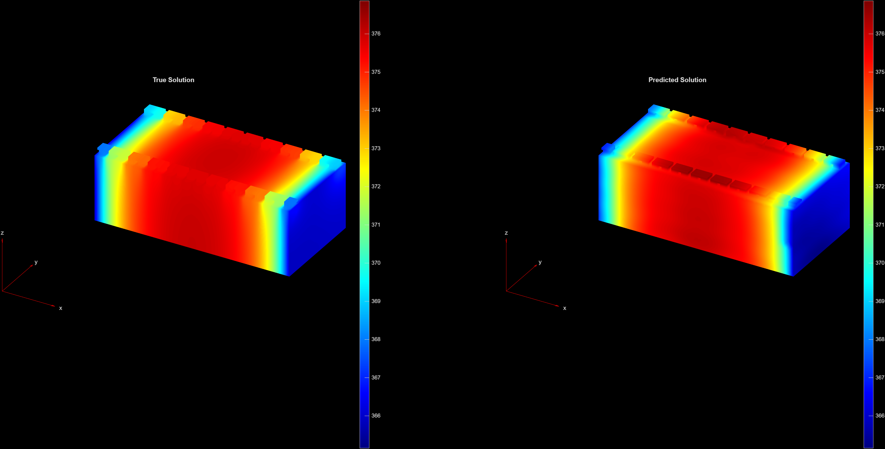
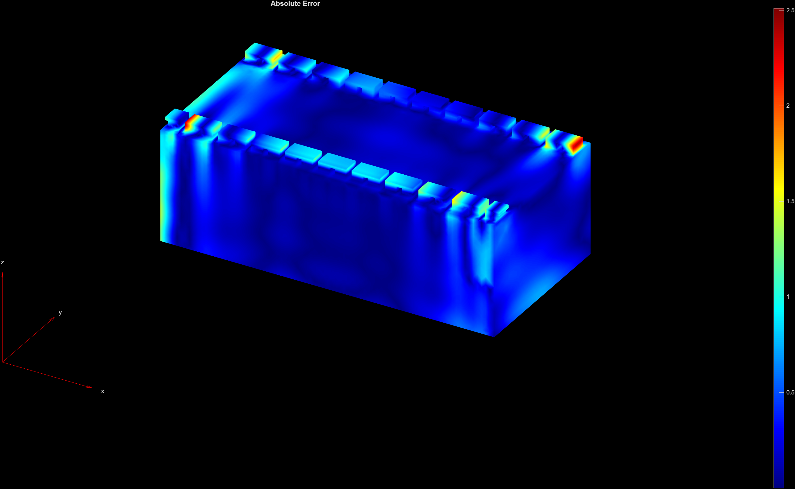
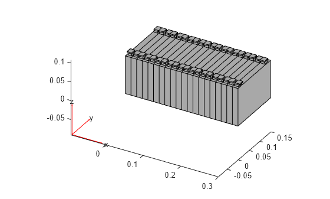
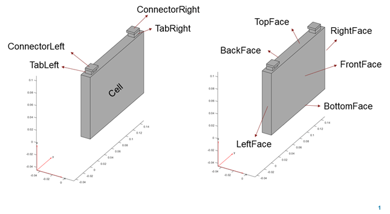

# Battery Module Cooling Analysis with Fourier Neural Operator

This example demonstrates applying a Fourier Neural Operator [1] to heat analysis of a 3D battery module.




## Setup

Run the example by running [`example.mlx`](./example.mlx).

## Requirements

Requires
- [MATLAB](https://www.mathworks.com/products/matlab.html) (R2025a or newer)
- [Deep Learning Toolbox&trade;](https://www.mathworks.com/products/deep-learning.html)
- [Partial Differential Equation Toolbox&trade;](https://uk.mathworks.com/products/pde.html)
- [Parallel Computing Toolbox&trade;](https://uk.mathworks.com/products/parallel-computing.html) (for training on a GPU)

## References
[1] Li, Zongyi, Nikola Borislavov Kovachki, Kamyar Azizzadenesheli, Burigede Liu, Kaushik Bhattacharya, Andrew Stuart, and Anima Anandkumar. 2021. "Fourier Neural Operator for Parametric Partial Differential Equations." In International Conference on Learning Representations. https://openreview.net/forum?id=c8P9NQVtmnO.

## Example

This example applies a 3D Fourier Neural Operator (FNO) to a thermal analysis of a mattery module. The battery module is composed of a number of cells.



Each cell has the same geometry, as specified by the parameters on this plot.



The following is an overview of some key parts of the `example.mlx`.

The [`createBatteryModuleGeometry`](./createBatteryModuleGeometry.m) function creates the battery module geometry as the variable `geomModule`, an instance of [`fegeometry`](https://uk.mathworks.com/help/pde/ug/fegeometry.html). The `geomModule` can be used by the [`femodel`](https://uk.mathworks.com/help/pde/ug/femodel.html) function, which creates an object that can be used to specify and solve the underlying partial differential equation (PDE).

```
model = femodel(AnalysisType="thermalTransient", Geometry=geomModule);
```

The `"thermalTransient"` input specifies that this is a heat equation that evolves with time. The [`materialProperties`](https://uk.mathworks.com/help/pde/ug/pde.materialproperties.html), [`faceLoad`](https://uk.mathworks.com/help/pde/ug/faceload.html) and [`cellLoad`](https://uk.mathworks.com/help/pde/ug/cellload.html) functions are used to specify the corresponding properties on the domain. In this example the `AmbientTemperature`, `ConvectionCoefficient` and `Heat` for specified faces and cells are set to various values from a collection of potential values `params`, and each instance of the model is solved to generate training data.
```
results = cell(size(params,1),1);
for i = 1:size(params,1)
    model.FaceLoad([boundaryIDs(1).FrontFace, ...
        boundaryIDs(end).BackFace]) = ...
        faceLoad(ConvectionCoefficient=params(i,2), ...
        AmbientTemperature=params(i,1));

    nominalHeatGen = params(i,3)/volume(1).Cell;
    model.CellLoad(cellIDs) = cellLoad(Heat=nominalHeatGen);

    model.CellIC = cellIC(Temperature=params(i,1));

    T = 60*10;
    results{i} = solve(model,0:60:T);
end
```

The `results` hold information about the specification and solution of the PDE. These values may be known only at the vertices of the `femodel`-s mesh. However methods like FNO typically require the data to be layed out on a grid, like the grids that `meshgrid` and `ndgrid` produce. The workaround used in this example is to interpolate from the mesh vertices onto a grid using [`scatteredInterpolant`](https://uk.mathworks.com/help/matlab/ref/scatteredinterpolant.html). For example the `ConvectionCoefficient` values that were specified on the front and back face of the battery module are interpolated with the following code.

```
F = scatteredInterpolant(result.Mesh.Nodes.', convection);
convectionGrid = F(X,Y,Z);
```

This gives us input data `U` and target data `V` on a 32 x 32 x 32 grid. The array `U` is 32 x 32 x 32 x 6 x 216 and `V` is 32 x 32 x 32 x 1 x 216. Each of `U(:,:,:,:,i), V(:,:,:,:,i)` is a distinct observation. The entries `U(:,:,:,1:3,:)` are the $(x,y,z)$ coordinates of the grid, and `U(:,:,:,4:6,:)` are the ambient temperature, convection coefficient and heat generation values respectively, each interpolated from the mesh vertices on which they were specified to the grid. The target `V` is the temperature of the battery module interpolated from the solution on the mesh vertices to the grid points, after the battery has cooled for 10 minutes.

This data can now be used directly by a 3D FNO. Using the provided [`spectralConvolution3dLayer`](./spectralConvolution3dLayer.m) the following code creates a Fourier layer that combines the spectral convolution with a non-linear activation, a normalization layer and a separate linear layer.
```
function layer = fourier3dLayer(numModes,hiddenSize,args)
arguments
    numModes
    hiddenSize
    args.Activation = @geluLayer
end
layers = [
    identityLayer(Name="in")
    spectralConvolution3dLayer(numModes,hiddenSize)
    additionLayer(2,Name="add")
    layerNormalizationLayer
    args.Activation()];
net = dlnetwork(layers,Initialize=false);
net = net.addLayers(convolution3dLayer(1,hiddenSize,Name="conv"));
net = connectLayers(net,"conv","add/in2");
net = connectLayers(net,"in","conv");
layer = networkLayer(net);
end
```

The FNO is completed by connecting a number of Fourier layers in sequence, with linear lifting and projection layers, and additional residual connections.
```
layers = [
    inputLayer([n,n,n,size(U,4),NaN],'SSSCB',Name="in")
    convolution3dLayer(1,2*hiddenSize,Padding="same")
    layerNormalizationLayer
    geluLayer
    convolution3dLayer(1,hiddenSize,Padding="same")
    repmat(residualLayer(fourier3dLayer(numModes,hiddenSize)),nlayers,1)
    convolution3dLayer(1,2*hiddenSize,Padding="same")  
    layerNormalizationLayer
    geluLayer
    convolution3dLayer(1,size(V,4),Padding="same")];
```

This is then trained on the data using [`trainnet`](https://uk.mathworks.com/help/deeplearning/ref/trainnet.html).

```
net = dlnetwork(layers,Initialize=false);

opts = trainingOptions("adam",...
    Plots="training-progress",...
    MiniBatchSize = 8,...
    InputDataFormats="SSSCB",...
    TargetDataFormats="SSSCB",...
    Shuffle="every-epoch",...
    ValidationData = {Uval,Vval},...
    ValidationFrequency=100,...
    MaxEpochs = 1000);

net = trainnet(Unorm,Vnorm, net, "l2loss" ,opts);
```

The [`minibatchpredict`](https://uk.mathworks.com/help/deeplearning/ref/minibatchpredict.html) function then makes it easy to predict the temperature quickly on the 43 observations in the validation data. This takes about 5s to predict the temperature for all 43 validation observations.
```
pred = minibatchpredict(net,Uval);
```

The predictions are on the 32 x 32 x 32 grid that was specified before. The [`griddedInterpolant`](https://uk.mathworks.com/help/matlab/ref/griddedinterpolant.html) function can interpolate the grid back to the mesh vertices.

```
P = [2,1,3];
result = results{idxVal(i)};
interpolation = griddedInterpolant(...
    permute(X,P),...
    permute(Y,P),...
    permute(Z,P),...
    permute(pred(:,:,:,:,i),P),...
    'spline');
interpolatedPrediction = interpolation(result.Mesh.Nodes.');
```

Once the data has been interpolated back to the mesh vertices, the [`pdeplot3D`](https://uk.mathworks.com/help/pde/ug/pdeplot3d.html) can be used to create the plots above.

```
pdeplot3D(result.Mesh, ColorMapData = interpolatedPrediction, FaceAlpha = 1);
```

#

Copyright 2025 The MathWorks, Inc.
