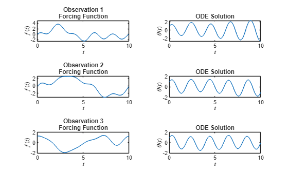
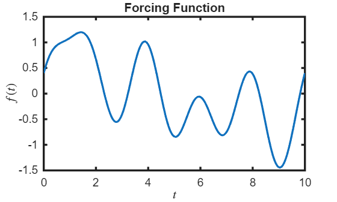
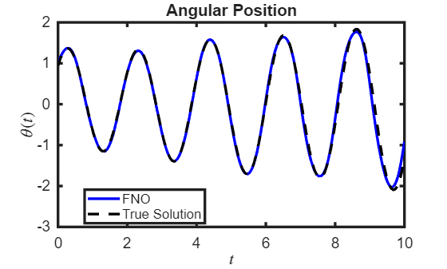
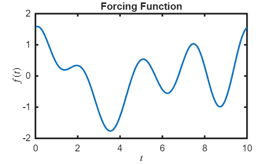

# Fourier Neural Operator for Nonlinear Pendulum

This example demonstrates how to use a Fourier Neural Operator (FNO) to model the dynamics of a nonlinear pendulum with a time\-dependent forcing term. The governing equation is given by the following second\-order ordinary differential equation (ODE):


 $\ddot{\theta} (t)=-\omega_0^2 \sin (\theta (t))+f(t)$,


where $\theta$ is the angular position, $\omega_0$ is the natural frequency, and $f$ is the an external forcing function. 


Traditionally, solving this system for a new forcing function $f$ requires numerically solving the ODE from scratch. In constrast, an FNO learns a mapping from the input forcing function $f$ to the corresponding solution $\theta$, enabling rapid inference without re\-solving the equation.


The FNO is trained on a dataset of input\-output pairs $(f_i (t),\theta_i (t))$, and once trained, it can predict $\theta$ for unseen forcing functions. While this approach may be excessive for simple ODEs like the pendulum, it can be advantageous for complex simulations involving partial differential equations (PDEs), where traditional solvers (e.g. finite element method) are computationally expensive.

# Generate or Import Data
```matlab
% Get the path to the main directory
mainDir = findProjectRoot('generatePendulumDataFNO.m');
% If first time generating data, set generateData to true. Else, set to false.
res = 512;
generateData = 1;
if generateData
    g = 9.81; r = 1; 
    omega0 = sqrt(g/r);
    x0 = [0.5;0.5*omega0];
    numSamples = 2000;
    doPlot = 0;
    generatePendulumDataFNO(omega0,x0,numSamples,res,doPlot);
end
```

```matlabTextOutput
FNO data of resolution 512 written to fno_data_512.mat 
```

```matlab
% Construct full path to the data file
dataFile = fullfile(mainDir, 'pendulumData', sprintf('fno_data_%d.mat',res));
% Read the data
load(dataFile,'data');
res = 512;

f = data.fSamples;
theta = data.thetaSamples;
t = data.tGrid;

% normalize and center the data
fMean = mean(f, 'all');
fStd = std(f, 0, 'all');
thetaMean = mean(theta, 'all');
thetaStd = std(theta, 0, 'all');
f = (f - fMean) / fStd;
theta = (theta - thetaMean) / thetaStd;

% visualize some of the training data
numPlots = 3;
figure
tiledlayout(numPlots,2)
for i = 1:numPlots
    nexttile
    plot(t,f(i,:));
    title("Observation " + i + newline + "Forcing Function")
    xlabel("$t$",Interpreter='latex');
    ylabel("$f(t)$",Interpreter='latex');

    nexttile
    plot(t,theta(i,:));
    title("ODE Solution")
    xlabel("$t$",Interpreter='latex')
    ylabel("$\theta(t)$",Interpreter='latex')
end
```


# Prepare Training Data
```matlab
numObservations = size(f,1);
[idxTrain,idxValidation,idxTest] = trainingPartitions(numObservations,[0.8 0.1 0.1]);
fTrain = f(idxTrain,:);
thetaTrain = theta(idxTrain,:);
fValidation = f(idxValidation,:);
thetaValidation = theta(idxValidation,:);
fTest = f(idxTest,:);
thetaTest = theta(idxTest,:);
```

FNO requires input data which contains spatio\-temporal information. Concatenate the grid with the input data.

```matlab
tGridTrain = repmat(t, [numel(idxTrain) 1]);
tGridValidation = repmat(t, [numel(idxValidation) 1]);
fTrain = cat(3,fTrain,tGridTrain);
fValidation = cat(3, fValidation, tGridValidation);

size(fTrain)
```

```matlabTextOutput
ans = 1x3
        1600         512           2

```

```matlab
size(fValidation)
```

```matlabTextOutput
ans = 1x3
   200   512     2

```

# Define Neural Network Architecture

Network consists of multiple Fourier\-GeLU blocks connected in series.

```matlab
numModes = 8;
tWidth = 32;
numBlocks = 4;

fourierBlock = [
    fourierLayer(numModes,tWidth)
    geluLayer];

layers = [
    inputLayer([NaN tWidth 2],"BSC");
    convolution1dLayer(1,tWidth,Name="fc0")
    repmat(fourierBlock,[numBlocks 1])
    convolution1dLayer(1,128)
    geluLayer
    convolution1dLayer(1,1)];
```
# Specify Training Options
```matlab
schedule = piecewiseLearnRate(DropFactor=0.5);

options = trainingOptions("adam", ...
    InitialLearnRate=1e-3, ...
    LearnRateSchedule=schedule, ...
    MaxEpochs=10, ...
    MiniBatchSize=64, ...
    Shuffle="every-epoch", ...
    InputDataFormats="BSC", ...
    Plots="training-progress", ...
    ValidationData={fValidation,thetaValidation}, ...
    Verbose=false);
```
# Train the Network
```matlab
net = trainnet(fTrain,thetaTrain,layers,"mse",options);
```


# Test the Model and Visualize Results
```matlab
tGridTest = repmat(t, [numel(idxTest) 1]);

fTest = cat(3,fTest,tGridTest);
mseTest = testnet(net,fTest,thetaTest,"mse")
```

```matlabTextOutput
mseTest = 0.0079
```


Visualize the predictions on the test set

```matlab
Y = minibatchpredict(net, fTest);
numTestPlots = 3;
for i = 1:numTestPlots
    figure();
    plot(t,fTest(i,:,1),LineWidth=2.5)
    title("Forcing Function")
    xlabel("$t$",Interpreter="latex")
    ylabel("$f(t)$",Interpreter="latex")
    set(gca,FontSize=14,LineWidth=2.5)
    figure();
    plot(t,Y(i,:),'b-',LineWidth=2.5,DisplayName='FNO'); hold on
    plot(t,thetaTest(i,:),'k--',LineWidth=2.5,DisplayName='True Solution'); hold off
    title("Angular Position")
    xlabel("$t$",Interpreter="latex")
    ylabel("$\theta(t)$",Interpreter="latex")
    legend(Location='best');
    set(gca,FontSize=14,LineWidth=2.5)
end
```








