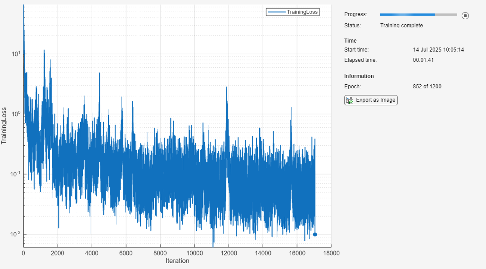
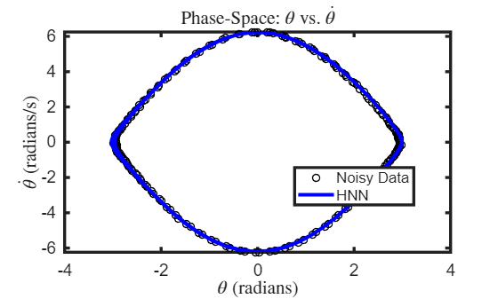
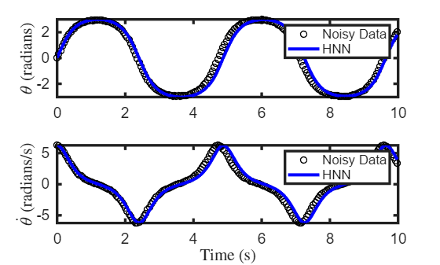

<a id="TMP_515f"></a>

# Hamiltonian Neural Network for Nonlinear Pendulum

This example demonstrates how to use a **Hamiltonian Neural Network (HNN)** to learn the dynamics of a nonlinear pendulum from noisy observational data. HNNs incorporate physical structure by learning the system's Hamiltonian and using Hamilton's equations to compute the time evolution of the state.


The true dynamics of the nonlinear pendulum are governed by the second\-order differential equation:


 $\ddot{\theta} =-\omega_0^2 \sin \theta$,


where $\theta$ is the angular position and $\omega_0$ is the natural frequency. We assume access to noisy measurements of $\theta$ and the angular velocity $\dot{\theta}$, as well as their time derivatives, which in this example are approximated numerically. 


The input to the HNN is the state vector $[q,p]=[\theta ,\dot{\theta} ]$. The network outputs the scalar\-valued Hamiltonian $\mathcal{H}(q,p)$. Using automatic differentiation, the penalizes deviations from Hamilton's equations via a custom loss function:

 $$ {L\left(q,p\right)=\left\|\frac{\textrm{dq}}{\textrm{dt}}-\frac{\partial \mathcal{H}}{\partial p}\right\|}_2^2 +{\left\|\frac{\textrm{dp}}{\textrm{dt}}+\frac{\partial \mathcal{H}}{\partial q}\right\|}_2^2 $$ 

to ensure the learned Hamiltonian produces physically consistent dynamics. Once the network is trained, predictions are made by solving Hamilton's equations 

 $ \frac{dq}{dt}=\frac{\partial \mathcal{H}}{\partial p}, $  $ \frac{dp}{dt}=-\frac{\partial \mathcal{H}}{\partial p} $  

using the learned Hamiltonian. 

<a id="TMP_42e5"></a>

# Prepare Data for Training

Load the data contained in  `pendulum_qp_dqdp.mat` if it already exists, or generate and save the data if not. 

```matlab
% Get the path to the main directory
mainDir = findProjectRoot('generatePendulumData.m');
% If first time generating data, set generateData to true. Else, set to false.
generateData = 1;
if generateData
    g = 9.81; r = 1; 
    omega0 = sqrt(g/r);
    x0 = [0;1.99*sqrt(9.81)];
    tSpan = linspace(0,20,400);
    noiseLevel = 0.01;
    doPlot = 0;
    generatePendulumData(omega0,x0,tSpan,noiseLevel,doPlot);
end
```

```matlabTextOutput
Pendulum data written to pendulum_qp_dqdp.mat
```

```matlab
% Construct full path to the data file
dataFile = fullfile(mainDir, 'pendulumData', 'pendulum_qp_dqdp.mat');
% Read the data
load(dataFile,'data');
theta = data.thetaNoisy;   % Noisy angle measurements (radians)
omega = data.omegaNoisy;   % Noisy angular velocity measurements (radians/sec)
t = data.t;                % Time vector

% Numerical derivatives (targets)
qdot = data.thetaDot;      % d(theta)/dt
pdot = data.omegaDot;      % d(omega)/dt
```

Use data up to $t=10$ for training. 

```matlab
inds = find(t <= 10);
tTrain = t(inds);
q = theta(inds);
p = omega(inds);
qdot = qdot(inds);
pdot = pdot(inds);
```

Prepare the data

```matlab
inputs = [q p];          % (N)x(2) array
targets = [qdot pdot];   % (N)x(2) array
```

Convert data to array datastore

```matlab
inputds = arrayDatastore(inputs, IterationDimension=1);
targetds = arrayDatastore(targets, IterationDimension=1);
ds = combine(inputds, targetds);
```
<a id="TMP_5a22"></a>

# Build the HNN Architecture

We represent the Hamiltonian $\mathcal{H}$ using a simple multilayer perceptron (MLP). The network takes a 2\-dimensional input and outputs a single scalar value for the Hamiltonian.


The architecture consists of:

-  Input: 2\-dimensional state vector $[q,p]=[\theta ,\dot{\theta} ]$ 
-  Hidden layers: 2 [fully connected layers](https://www.mathworks.com/help/deeplearning/ref/nnet.cnn.layer.fullyconnectedlayer.html), each with 64 neurons 
-  Activation function: [Hyperbolic tangent (tanh) ](https://www.mathworks.com/help/deeplearning/ref/nnet.cnn.layer.tanhlayer.html) 
-  Output: 1\-dimensional value representing the Hamiltonian $\mathcal{H}(q,p)$ 
```matlab
inputSize = 2;
outputSize = 1;
numHiddenLayers = 2;
hiddenSize = 64; 

fcBlock = [
    fullyConnectedLayer(hiddenSize)
    tanhLayer];
layers = [
    featureInputLayer(inputSize)
    repmat(fcBlock,[numHiddenLayers 1])
    fullyConnectedLayer(outputSize)];
rng(0); % for reproducibility
net = dlnetwork(layers);
net = dlupdate(@double, net);
```
<a id="TMP_77ff"></a>

# Specify Training Options

Here we define some of the options we will use for the ADAM optimizer in our custom training loop.

```matlab
numEpochs = 1200;
miniBatchSize = 10;
executionEnvironment = "auto";
initialLearnRate = 0.01;
decayRate = 1e-4;
N = length(tTrain);
numIterationsPerEpoch = ceil(N/miniBatchSize);
numIterations = numEpochs*numIterationsPerEpoch;
```

Create a mini\-batch queue.

```matlab
mbq = minibatchqueue(ds, ...
    MiniBatchSize=miniBatchSize, ... 
    MiniBatchFormat="BC", ...
    OutputEnvironment=executionEnvironment, ...
    OutputCast="double");
averageGrad = [];
averageSqGrad = [];
```

Accelerate training.

```matlab
accfun = dlaccelerate(@modelLoss);
```

Create a monitor to track the training progress.

```matlab
monitor = trainingProgressMonitor( ...
    Metrics="TrainingLoss", ...
    XLabel="Iteration", ...
    Info="Epoch");
```



```matlab
yscale(monitor,"TrainingLoss","log");
```
<a id="TMP_1703"></a>

# Train the Network 

We use a custom training loop. For more information on custom training loops, see [https://www.mathworks.com/help/deeplearning/custom\-training\-loops.html.](https://www.mathworks.com/help/deeplearning/custom-training-loops.html.) 

```matlab
iteration = 0;
epoch = 0;
monitor.Status = "Running";
tol = 1e-2;
loss = 1000;
while epoch < numEpochs && ~monitor.Stop && loss > tol
    epoch = epoch + 1;
    shuffle(mbq);
    while hasdata(mbq) && ~monitor.Stop
        iteration = iteration + 1;
        [X, T] = mbq.next();
        [loss, grad] = dlfeval(accfun, net, X, T);
        % update learning rate
        learningRate = initialLearnRate/(1+decayRate*iteration);
        % Update the network parameters using the adamupdate function.
        [net,averageGrad,averageSqGrad] = adamupdate(net,grad,averageGrad, ...
            averageSqGrad,iteration,learningRate);
        recordMetrics(monitor, iteration, TrainingLoss=loss);
        updateInfo(monitor,Epoch=string(epoch)+" of "+string(numEpochs));
    end
    monitor.Progress = 100*epoch/numEpochs;
end
```

Update the training status.

```matlab
if monitor.Stop == 1
    monitor.Status = "Training stopped";
else
    monitor.Status = "Training complete";
end
```


<a id="TMP_63f0"></a>

# Predict the Pendulum Trajectory

Use the model to make predictions with the Hamiltonian NN. In order to make predictions, we need to solve the ODE system:


 $\frac{dq}{dt}=\frac{\partial H}{\partial p}$, $\frac{dp}{dt}=-\frac{\partial H}{\partial q}$. 

```matlab
accModel = dlaccelerate(@model);
tspan = tTrain;
x0 = dlarray([q(1); p(1)]); % initial conditions
odeFcn = @(ts,xs) dlfeval(accModel, net, xs);
[~, qp] = ode45(odeFcn, tspan, x0);
qp = qp'; % Transpose to return to (2)x(N)
```
<a id="TMP_549d"></a>

# Visualize the Results
```matlab
% Plot phase portrait
figure();
plot(q,p,'ko',DisplayName='Noisy Data',LineWidth=1); hold on
plot(qp(1,:),qp(2,:),'b-',DisplayName='HNN',LineWidth=3);
xlabel('$\theta$ (radians)',Interpreter='latex')
ylabel('$\dot{\theta}$ (radians/s)',Interpreter='latex')
title('Phase-Space: $\theta$ vs. $\dot{\theta}$',Interpreter='latex');
legend('Location', 'best');
set(gca,FontSize=14,LineWidth=2.5)
hold off
```



```matlab
% Plot time vs angular position
figure;
subplot(2,1,1);
plot(tspan, q, 'ko', DisplayName='Noisy Data', LineWidth=1); hold on
plot(tspan, qp(1,:), 'b-', DisplayName='HNN', LineWidth=3);
legend();
ylabel('$\theta$ (radians)',Interpreter='latex');
set(gca,FontSize=14,LineWidth=2.5)

% Plot time vs angular velocity
subplot(2,1,2);
plot(tspan, p, 'ko', DisplayName='Noisy Data', LineWidth=1); hold on
plot(tspan, qp(2,:), 'b-', DisplayName='HNN', LineWidth=3);
ylabel('$\dot{\theta}$ (radians/s)',Interpreter='latex');
xlabel('Time (s)',Interpreter='latex');
set(gca,FontSize=14,LineWidth=2.5)
legend();
```


<a id="TMP_3357"></a>

## Helper Functions
```matlab
function [loss,gradients] = modelLoss(net, qp, qpdotTarget)
qpdot = model(net, qp);
loss = l2loss(qpdot, qpdotTarget, DataFormat="CB");
gradients = dlgradient(loss,net.Learnables);
end

function qpdot = model(net, qp)
H = forward(net,dlarray(qp,'CB'));
H = stripdims(H);
qp = stripdims(qp);
dH = dljacobian(H,qp,1);
qpdot = [dH(2,:); -1.*dH(1,:)];
end
```
