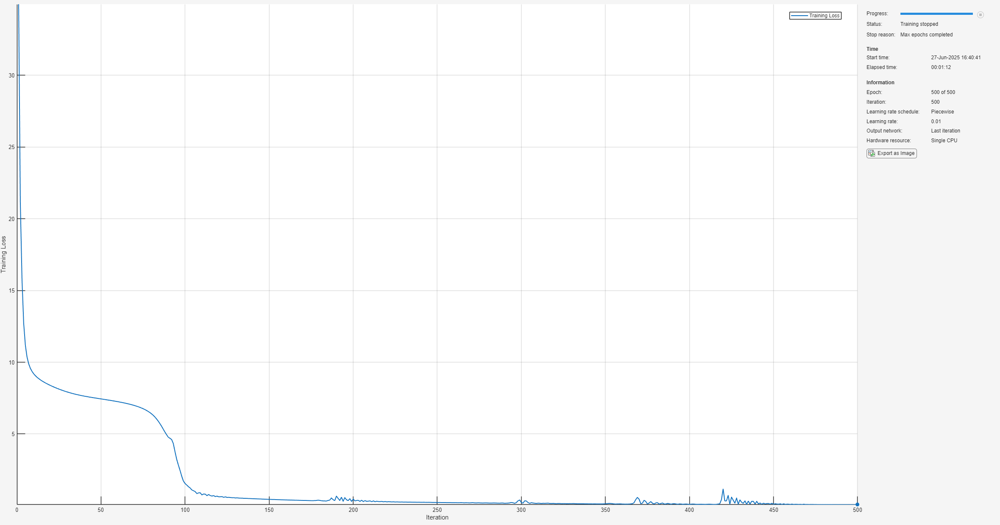

# Neural ODE for Noisy Pendulum Data

This example demonstrates how to use a **Neural Ordinary Differential Equation (Neural ODE)** to model the dynamics of a nonlinear pendulum from noisy data. The Neural ODE learns the time evolution of the pendulum's angle $\theta$ and angular velocity $\dot{\theta}$ directly from observations.


The true dynamics of the nonlinear pendulum are governed by the second\-order differential equation:


 $\ddot{\theta} =-\omega_0^2 \sin \theta$.


We rewrite this as a first\-order system:

 $$ \frac{d}{\textrm{dt}}\left\lbrack \begin{array}{c} \theta \\ \dot{\theta}  \end{array}\right\rbrack =\mathit{\mathbf{f}}\left(\theta ,\dot{\theta} \right) $$ 

In the Neural ODE framework, the unknown dynamics $\mathbf{f}$ are approximated using a neural network, which is trained to fit the observed trajectories. 

# Prepare Data for Training

Load the data contained in  `pendulum_qp_dqdp.mat` if it already exists, or generate and save the data if not. 

```matlab
% Get the path to the main directory
mainDir = findProjectRoot('generatePendulumData.m');
% If first time generating data, set generateData to true. Else, set to false.
generateData = 1;
if generateData
    g = 9.81; r = 1; 
    omega0 = sqrt(g/r);
    x0 = [0;1.99*sqrt(9.81)];
    tSpan = linspace(0,20,400);
    noiseLevel = 0.01;
    doPlot = 0;
    generatePendulumData(omega0,x0,tSpan,noiseLevel,doPlot);
end
% Construct full path to the data file
dataFile = fullfile(mainDir, 'pendulumData', 'pendulum_qp_dqdp.mat');
% Read the data
load(dataFile,'data');
theta = data.thetaNoisy;   % Noisy angle measurements (radians)
omega = data.omegaNoisy;   % Noisy angular velocity measurements (radians/sec)
t = data.t;                 % Time vector
```

Train on dataset where $t\le 10$ 

```matlab
inds = find(t <= 10);
tTrain = t(inds);
```

Combine into a single matrix: $[\theta ,\omega ]$ 

```matlab
Y = [theta(inds), omega(inds)]; % N x 2
```

Prepare target data (excluding the initial condition)

```matlab
Ytarget = Y(2:end, :); % (N-1) x 2
```

Format for Neural ODE: (Channels x Batch x Time)

```matlab
Ytrain = permute(Ytarget, [2 3 1]); % Now size is 2 x 1 x (N-1) (C x B x T)
Ytrain = dlarray(Ytrain, "CBT");
```

Initial condition (first row of `theta` and `omega`)

```matlab
Xtrain = reshape([theta(1); omega(1)], [2 1]); % 2 x 1
Xtrain = dlarray(Xtrain, "CB");
```
# Define the Neural ODE model

To model the right\-hand side of the ODE, we define a neural network that approximates the unknown dynamics function $f$. Here we use a multilayer perceptron (MLP) with the following architecture: 

-  Input: 2\-dimensional state vector $[\theta ,\dot{\theta} ]$ 
-  Hidden layers: 2 [fully connected layers](https://www.mathworks.com/help/deeplearning/ref/nnet.cnn.layer.fullyconnectedlayer.html), each with 32 neurons 
-  Activation function: [Gaussian error linear unit (GELU)](https://www.mathworks.com/help/deeplearning/ref/nnet.cnn.layer.gelulayer.html) 
-  Ouput: 2\-dimensional vector representing $\frac{d}{dt}[\theta ,\dot{\theta} ]$ 
```matlab
fLayers = [
    featureInputLayer(2, Name="input")
    fullyConnectedLayer(32)
    geluLayer
    fullyConnectedLayer(32)
    geluLayer
    fullyConnectedLayer(2, Name="output")
];
rng(0); % for reproducibility
fNet = dlnetwork(fLayers);
```

Instead of training the model on the derivatives $\dot{\theta}$ and $\ddot{\theta}$, we use an [ODE solver](https://www.mathworks.com/help/deeplearning/ref/dlarray.dlode45.html), to integrate the output of fNet over time, starting from the initial condition `Xtrain`. The solver produces a predicted trajectory of the state $[\theta ,\dot{\theta} ]$, which is then compared to the observed data `Ytrain`, and the network is optimized to minimize the error bewteen the predicted and actual trajectories.  


The [neuralODElayer](https://www.mathworks.com/help/deeplearning/ref/nnet.cnn.layer.neuralodelayer.html) approximately solves the system


 $\frac{d}{\textrm{dt}}\left\lbrack \begin{array}{c} \theta \\ \dot{\theta}  \end{array}\right\rbrack =f\left(\theta ,\dot{\theta} \right)$, 


where the righthand side is the output of `fNet.`

```matlab
nODElayers = [
    featureInputLayer(2, Name="IC_in")
    neuralODELayer(fNet, tTrain, ...
    GradientMode="adjoint", ... 
    Name="ODElayer")
];
nODEnet = dlnetwork(nODElayers);
```
# Specify Training Options

Here we use the ADAM optimizer with settings like a minibatch size of 50 and 300 maximum epochs. 

```matlab
opts = trainingOptions("adam", ...
    Plots="training-progress", ...
    MiniBatchSize=50, ...
    MaxEpochs=500, ...
    LearnRateSchedule="piecewise", ...
    LearnRateDropFactor=0.1, ...
    LearnRateDropPeriod=1200, ...
    InitialLearnRate=0.01, ...
    ExecutionEnvironment="cpu", ...
    Verbose=false);
```
# Train the Network

Train the model to fit the noisy pendulum data.

```matlab
nODEnet = trainnet(Xtrain, Ytrain, nODEnet, "l2loss", opts);
```


# Predict the Pendulum Trajectory

Used the trained network to predict the pendulum's trajectory. 

```matlab
Ypred = predict(nODEnet, Xtrain); % Output: 2 x 1 x (N-1)
Ypred = extractdata(Ypred); % Convert from dlarray to numeric
Ypred = squeeze(Ypred)'; % (N-1) x 2
```
# Visualize the Results

Plot the angle $\theta$ over time.

```matlab
figure;
subplot(2,1,1);
plot(tTrain, theta(inds), 'ko', DisplayName='Noisy Data',LineWidth=1); hold on 
plot(tTrain(2:end), Ypred(:,1), 'b-', LineWidth=3,DisplayName='Neural ODE'); hold off
legend();
ylabel('$\theta$ (radians)',Interpreter='latex');
set(gca,FontSize=14,LineWidth=2.5)
```

Plot the angular velocity $\dot{\theta}$ over time

```matlab
subplot(2,1,2);
plot(tTrain,omega(inds),'ko',DisplayName='Noisy Data',LineWidth=1); hold  on
plot(tTrain(2:end), Ypred(:,2), 'b-',DisplayName='Neural ODE',LineWidth=3);
legend();
ylabel('$\dot{\theta}$ (radians/s)',Interpreter='latex');
xlabel('Time (s)',Interpreter='latex');
set(gca,FontSize=14,LineWidth=2.5)
```


Plot the phase\-space: $\theta$ vs $\dot{\theta}$. 

```matlab
figure;
plot(theta(inds), omega(inds), 'ko', LineWidth=1, DisplayName='Noisy Data'); hold on;
hold on;
plot(Ypred(:,1), Ypred(:,2), 'b-', LineWidth=3, DisplayName='Neural ODE Prediction');
hold off;
legend('Location', 'best');
xlabel('$\theta$ (radians)',Interpreter='latex');
ylabel('$\dot{\theta}$ (radians/s)',Interpreter='latex');
set(gca,FontSize=14,LineWidth=2.5)
title('Phase-Space: $\theta$ vs. $\dot{\theta}$',Interpreter='latex');
```


