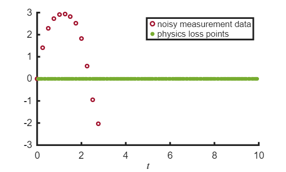

# Physics\-Informed Neural Network for Nonlinear Pendulum

This example demonstrates how to use a Physics\-Informed Neural Networks (PINN) to model the dynamics of a nonlinear pendulum governed by the second\-order differential equation:


 $\ddot{\theta} =-\omega_0^2 \sin \theta$.


We assume access to sparse, noisy measurements of the pendulum's angular position $\theta$ over a short time interval $[0,3]$, and aim to predict its behavior over a longer interval $[0,10]$. Rather than relying solely on the data, the PINN incorporates the governing ODE directly into the training process through the loss function. 


The network is trained to minimize a composite loss function that includes:

-  a data loss, which penalizes the difference between the network's predictions and the given measurements of $\theta$, and  
-  a physics loss, which penalizes violations of the governing pendulum equation.  

# Prepare Data for Training

Load the data contained in  `pendulum_qp_dqdp.mat` if it already exists, or generate and save the data if not.

```matlab
% Get the path to the main directory
mainDir = findProjectRoot('generatePendulumData.m');
% If first time generating data, set generateData to true. Else, set to false.
generateData = 1;
if generateData
    g = 9.81; r = 1; 
    omega0 = sqrt(g/r);
    x0 = [0;1.99*omega0];
    tSpan = linspace(0,20,400);
    noiseLevel = 0.01;
    doPlot = 0;
    generatePendulumData(omega0,x0,tSpan,noiseLevel,doPlot);
end
% Construct full path to the data file
dataFile = fullfile(mainDir, 'pendulumData', 'pendulum_qp_dqdp.mat');
% Read the data
load(dataFile,'data');
theta = data.thetaNoisy;   % Noisy angle measurements (radians)
t = data.t;                % Time vector
```

Use data up to $t=3$ for training. 

```matlab
inds = find(t <= 3);
tData = t(inds); 
thetaData = theta(inds); 
```

Remove points from the training set to model the scenario where we have sparse data. 

```matlab
tData = tData(1:5:end);
thetaData = thetaData(1:5:end);
```

Create points in $[0,10]$ at which to enforce the physics loss.

```matlab
% physics loss points
numInternalCollocationPoints = 200;
pointSet = sobolset(1);
points = 10*net(pointSet,numInternalCollocationPoints);
tPhysics = points(2:end); % remove 0 from the training data as this is the initial time and is handled in the ICs. 

% visualize the training data
hold on;
scatter(tData,thetaData,24,[0.6350 0.0780 0.1840],DisplayName='noisy measurement data',LineWidth=2);
scatter(tPhysics,zeros(length(tPhysics),1),30,[0.4660 0.6740 0.1880],"filled",DisplayName='physics loss points'); 
xlabel('$t$',Interpreter='latex');
legend()
set(gca,FontSize=14,LineWidth=2.5)
hold off
```



Prepare data for training.

```matlab
tData = dlarray(tData',"CB");
thetaData = dlarray(thetaData',"CB");
t0 = dlarray(0,"CB");
theta0 = dlarray(0,"CB");
ds = arrayDatastore(tPhysics);
```
# Define the PINN Architecture

We represent the solution $\theta$ using a multilayer perceptron (MLP) that maps time $t$ to the pendulum angle $\theta$. The network architecture consists of:

-  Input: 1\-dimensional input representing time $t$, 
-  Hidden layers: 6 [fully connected layers](https://www.mathworks.com/help/deeplearning/ref/nnet.cnn.layer.fullyconnectedlayer.html), each with 64 neurons, 
-  Activation function: [Hyperbolic tangent (tanh)](https://www.mathworks.com/help/deeplearning/ref/nnet.cnn.layer.tanhlayer.html),  
-  Output: 1\-dimensional output representing the predicted angle $\theta$ 
```matlab
numHiddenLayers = 6;
numNeurons = 64;
fcBlock = [ % fully connected block
    fullyConnectedLayer(numNeurons)
    tanhLayer];
layers = [
    featureInputLayer(1) % one input (t)
    repmat(fcBlock,[numHiddenLayers 1]) % repeat fully connected block 6 times
    fullyConnectedLayer(1)]; % one output (theta)
rng(0); % for reproducibility
pinnNet = dlnetwork(layers);
pinnNet = dlupdate(@double,pinnNet);
```
# Define the Loss Function

To train the PINN, we define a composite loss function that combines physics, data, and initial condition constraints. 


**Physics\-Informed Loss**


The physics loss enforces the differential equation by penalizing deviations from the governing pendulum ODE. Functions like [`dllaplacian`](https://www.mathworks.com/help/releases/R2025a/deeplearning/ref/dlarray.dllaplacian.html?searchPort=60735) and [`dljacobian`](https://www.mathworks.com/help/deeplearning/ref/dlarray.dljacobian.html) make it simple to define derivative terms appearing in ordinary and partial differential equations for use in a PINN. 

```matlab
function loss = physicsInformedLoss(net,t)
    omega0 = sqrt(9.81/1);
    theta = forward(net,t);
    thetatt = dllaplacian(stripdims(theta),stripdims(t),1);
    residual = thetatt + omega0^2*sin(theta);
    loss = mean(residual.^2, 'all');
end
```

Alternatively, the physics loss can be created using the supporting function `ode2PINNLossFunction` available for download at [PINN Loss Function Generation with Symbolic Math](https://www.mathworks.com/matlabcentral/fileexchange/172049-pinn-loss-function-generation-with-symbolic-math).


**Initial Condition Loss**


The initial condition loss penalizes the network during training for violating the initial condition $\theta (t=0)=\theta_0$.

```matlab
function loss = initialConditionLoss(net,t0,theta0)
    thetaPred0 = forward(net,t0);
    loss = l2loss(thetaPred0,theta0);
end
```

**Data Loss**


The data loss penalizes the difference between the network's predictions and the given measurements of $\theta$.

```matlab
function loss = dataLoss(net, t, thetaTarget)
    theta = forward(net, t);
    loss = l2loss(theta, thetaTarget);
end
```

The total loss is a weighted combination of the physics, data, and initial condition losses.  

```matlab
function [loss, gradients, lossPinn, lossData, lossIC] = modelLoss(net, tData, thetaData, tPhysics, t0, theta0)
    lossPinn = physicsInformedLoss(net,tPhysics);
    lossData = dataLoss(net, tData, thetaData);
    lossIC = initialConditionLoss(net,t0,theta0);
    loss = 0.15*lossPinn + lossData + lossIC; % weight the individual loss terms
    gradients = dlgradient(loss, net.Learnables);
end
```
# Specify Training Options

We will use the L\-BFGS optimizer via the [`lbfgsupdate`](https://www.mathworks.com/help/deeplearning/ref/lbfgsupdate.html) function in a custom training loop in the next section.


Accelerate the model loss function.

```matlab
accFcn = dlaccelerate(@modelLoss);  
lossFcn = @(net) dlfeval(accFcn, net, tData, thetaData, dlarray(tPhysics,"BC"), t0, theta0);
solverState = [];
maxIterations = 5000;
gradientTolerance = 1e-6;
stepTolerance = 1e-6;
```

Monitor the training progress. Plot the total loss. 

```matlab
monitor = trainingProgressMonitor( ...
    Metrics="TrainingLoss", ...
    Info=["Iteration" "GradientsNorm" "StepNorm"], ...
    XLabel="Iteration");
```


# Train the Network

In order to train a PINN, we create a [custom training loop](https://www.mathworks.com/help/deeplearning/deep-learning-custom-training-loops.html). 

```matlab
iteration = 0;

while iteration < maxIterations && ~monitor.Stop
    iteration = iteration + 1;

    [pinnNet, solverState] = lbfgsupdate(pinnNet, lossFcn, solverState);

    updateInfo(monitor, ...
        Iteration=iteration, ...
        GradientsNorm=solverState.GradientsNorm, ...
        StepNorm=solverState.StepNorm);

    recordMetrics(monitor, iteration, TrainingLoss=solverState.Loss);
    monitor.Progress = 100 * iteration / maxIterations;

    if solverState.GradientsNorm < gradientTolerance || ...
       solverState.StepNorm < stepTolerance || ...
       solverState.LineSearchStatus == "failed"
        break
    end
end
```


# Visualize the Results

Use the PINN to predict the value of $\theta$ at 100 evenly spaced points between $[0,10]$. 

```matlab
tTest = linspace(0,10,100)';
thetaPred = predict(pinnNet,tTest);
plot(tTest, thetaPred, 'b-', DisplayName='PINN prediction', LineWidth = 3, Color='b');
hold on
```

Compare against the true solution.

```matlab
gValue = 9.81;
rValue = 1;
omega0 = sqrt(gValue/rValue);
thetaDot0 = 1.99*omega0;
sol = solveNonlinearPendulum(tTest,omega0,thetaDot0);
yTrue = sol.Solution;
plot(tTest,yTrue(1,:),'k--',DisplayName='Exact solution',LineWidth=3);

% show the training data
scatter(extractdata(tData),extractdata(thetaData),30,[0.6350 0.0780 0.1840],LineWidth=2.5,DisplayName='data points');
scatter(tPhysics,zeros(length(tPhysics),1),36,[0.4660 0.6740 0.1880],"filled",DisplayName='physics points'); 
xlabel('Time (s)',Interpreter='latex');
ylabel('$\theta$ (radians)',Interpreter='latex');
hold off
set(gca,FontSize=14,LineWidth=2.5)
legend();
```


