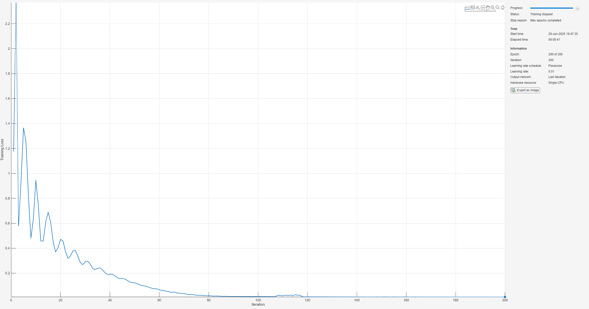
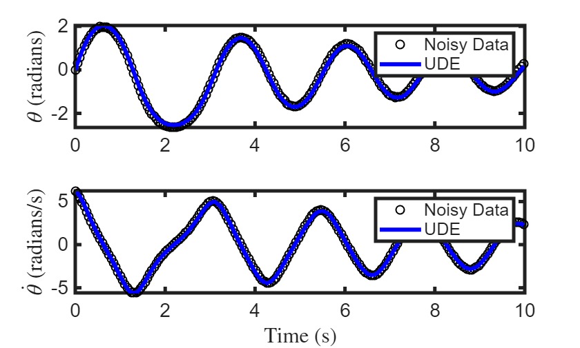
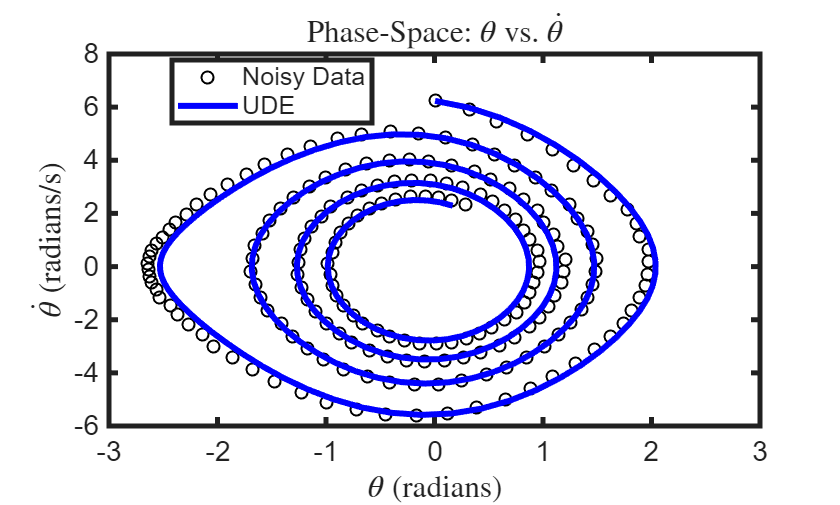
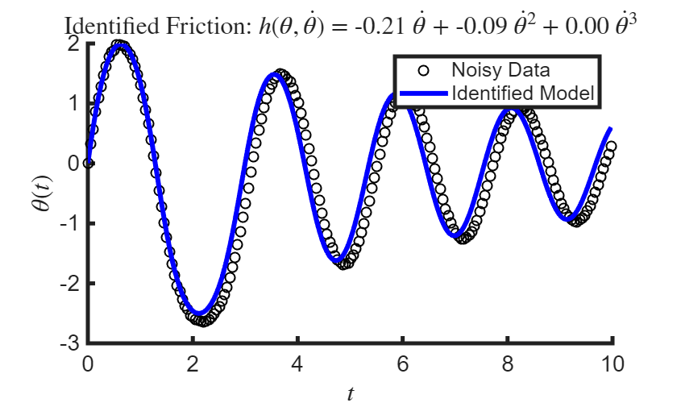
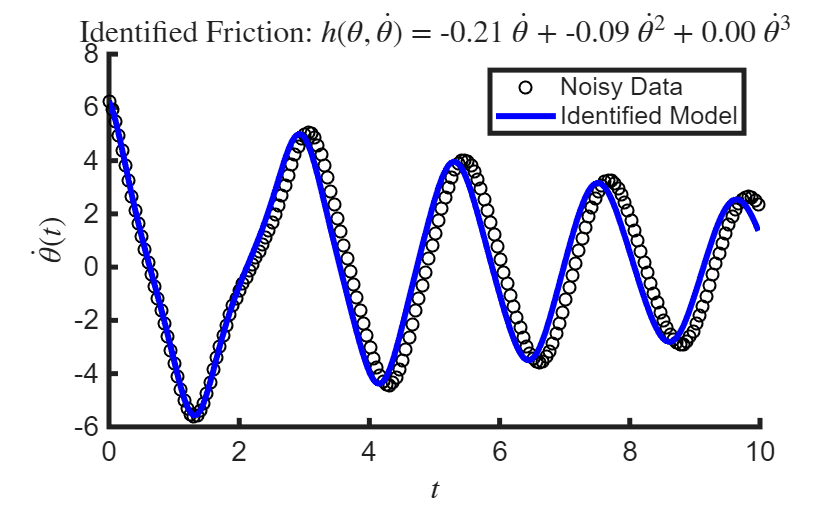

# Universal Differential Equation for Noisy Pendulum Data

This example demonstrates how to use a **Universal Differential Equation (UDE)** to model the dynamics of a nonlinear pendulum from noisy observational data. A UDE extends the concept of a neural ordinary differential equation (neural ODE) by incorporating known physical laws alongside neural networks, enabling the model to learn unknown or unmodeled dynamics.  


The true dynamics of a frictionless nonlinear pendulum are governed by the second\-order differential equation:


 $\ddot{\theta} =-\omega_0^2 \sin \theta$.


In this example, we assume the presense of an unknown frictional or damping force, denoted by $h$:


 $\ddot{\theta} =-\omega_0^2 \sin \theta +h(\theta ,\dot{\theta} )$.


We reforumulate this as a system of first\-order ODEs:


 $\frac{d}{\textrm{dt}}\left\lbrack \begin{array}{c} \theta \\ \dot{\theta}  \end{array}\right\rbrack =\left\lbrack \begin{array}{c} \dot{\theta} \\ -\omega_0^2 \sin \;\theta +h\left(\theta ,\dot{\;\theta } \right) \end{array}\right\rbrack =\mathit{\mathbf{g}}\left(\theta ,\dot{\theta} \right)+\left\lbrack \begin{array}{c} 0\\ h\left(\theta ,\dot{\theta} \right) \end{array}\right\rbrack$,


where $\mathbf{g}$ captures the known pendulum dynamics, and the unknown component $h$ is approximated using a neural network. 

```matlab
rng(0); % for reproducibility
warning('off');
```
# Prepare Data for Training

Import the data contained in  `pendulum_with_damping_qp_dqpdp_F.mat` if it already exists, or generate and save the data if not.

```matlab
% Get the path to the main directory
mainDir = findProjectRoot('generatePendulumDataWithDamping.m');
% If first time generating data, set generateData to true. Else, set to false.
generateData = 1;
if generateData
    g = 9.81; r = 1; 
    omega0 = sqrt(g/r);
    x0 = [0;1.99*sqrt(9.81)];
    tSpan = linspace(0,20,400);
    noiseLevel = 0.01;
    doPlot = 0;
    generatePendulumDataWithDamping(omega0,x0,tSpan,noiseLevel,doPlot);
end
```

```matlabTextOutput
Pendulum data written to pendulum_with_damping_qp_dqdp_F.mat
```

```matlab
% Construct full path to the data file
dataFile = fullfile(mainDir, 'pendulumData', 'pendulum_with_damping_qp_dqdp_F.mat');
% Read the data
load(dataFile,'data');

theta = data.thetaNoisy;   % Noisy angle measurements (radians)
omega = data.omegaNoisy;   % Noisy angular velocity measurements (radians/sec)
t = data.t;                % Time vector

% Numerical derivatives 
thetaDot = data.thetaDot;      % d(theta)/dt
omegaDot = data.omegaDot;      % d(omega)/dt

% Force
frictionForce = data.F_data;
```

Use only the dataset where $t\le 10$ to train.

```matlab
inds = find(t <= 10);
tTrain = t(inds);
```

Combine into single state vector: $X=[\theta ,\omega ]$. 

```matlab
Y = [theta(inds), omega(inds)]; % N x 2
```

Prepare target data (excluding the initial condition)

```matlab
Ytarget = Y(2:end, :); % (N-1) x 2
```

Format for Neural ODE: (Channels x Batch x Time)

```matlab
Ytrain = permute(Ytarget, [2 3 1]); % Now size is 2 x 1 x (N-1) (C x B x T)
Ytrain = dlarray(Ytrain, "CBT");
```

Initial condition (first row of theta and omega)

```matlab
Xtrain = reshape([theta(1); omega(1)], [2 1]); % 2 x 1
Xtrain = dlarray(Xtrain, "CB");
```
# Define the Neural ODE model

We define a function layer `gLayer` that encodes the known part of the dynamics, $\mathbf{g}$. 

```matlab
stateSize = 2; % X = [theta; omega]
omega0 = sqrt(9.81/1);
gFcn = @(X) [X(2,:); -omega0^2*sin(X(1,:))];
gLayer = functionLayer(gFcn, Acceleratable=true, Name="g");
```

We use a small multilayer perceptron (MLP) to approximate the unknown dynamics, $h$:

```matlab
hLayers = [
    fullyConnectedLayer(16,Name="fc1")
    geluLayer
    fullyConnectedLayer(1,Name="h")
];
```

Define a custom layer to add the known and learned parts of the dynamics.

```matlab
combineFcn = @(x, y) [x(1,:); x(2,:) + y];
combineLayer = functionLayer(combineFcn,Name="combine",Acceleratable=true);
```

Construct the full network by connecting the input to both the known physics and the neural network, and combining their outputs. 

```matlab
fNet = [featureInputLayer(stateSize,Name="input") 
    gLayer
    combineLayer];
rng(0); % for reproducibility
fNet = dlnetwork(fNet,Initialize=false);
fNet = addLayers(fNet,hLayers);
fNet = connectLayers(fNet,"input","fc1");
fNet = connectLayers(fNet,"h","combine/in2");
```

Use a [`neuralODELayer`](https://www.mathworks.com/help/deeplearning/ref/nnet.cnn.layer.neuralodelayer.html) to integrate the system over time, starting from the initial condition.

```matlab
nODElayers = [
    featureInputLayer(stateSize, Name="IC_in")
    neuralODELayer(fNet, tTrain, ...
    GradientMode="adjoint", ...
    Name="ODElayer")
];
rng(0); % for reproducibility
nODEnet = dlnetwork(nODElayers);
```
# Specify Training Options

Here, we use the ADAM optimizer with a mini\-batch size of 50 and 200 maximum epochs. 

```matlab
opts = trainingOptions("adam", ...
    Plots="training-progress", ...
    MiniBatchSize=50, ...
    MaxEpochs=200, ...
    LearnRateSchedule="piecewise", ...
    LearnRateDropFactor=0.1, ...
    LearnRateDropPeriod=1200, ...
    InitialLearnRate=0.01, ...
    ExecutionEnvironment="cpu", ...
    Verbose=false);
```
# Train the Network
```matlab
rng(0); % for reproducibility
nODEnet = trainnet(Xtrain, Ytrain, nODEnet, "l2loss", opts);
```


# Predict the Pendulum Trajectory

Used the trained network to predict $[\theta ,\dot{\theta} ]$ from an initial condition. 

```matlab
Ypred = predict(nODEnet, Xtrain); % Output: 2 x 1 x (N-1)
Ypred = extractdata(Ypred); % Convert from dlarray to numeric
Ypred = squeeze(Ypred)'; % (N-1) x 2
```
# Visualize the Results

Plot the angle $\theta$ over time.

```matlab
figure;
subplot(2,1,1);
plot(tTrain, theta(inds), 'ko', DisplayName='Noisy Data', LineWidth=1); hold on
plot(tTrain, [Xtrain(1); Ypred(:,1)], 'b-', DisplayName='UDE', LineWidth=3); hold off
legend();
ylabel('$\theta$ (radians)',Interpreter='latex');
set(gca,FontSize=14,LineWidth=2.5)
```

Plot the angular velocity $\dot{\theta}$ over time

```matlab
subplot(2,1,2);
plot(tTrain, omega(inds), 'ko', DisplayName='Noisy Data', LineWidth=1); hold on
plot(tTrain, [Xtrain(2); Ypred(:,2)], 'b-', DisplayName='UDE', LineWidth=3); hold off
legend();
ylabel('$\dot{\theta}$ (radians/s)',Interpreter='latex');
xlabel('Time (s)',Interpreter='latex');
set(gca,FontSize=14,LineWidth=2.5)
```



Plot the phase\-space: $\theta$ vs $\dot{\theta}$. 

```matlab
figure;
plot(theta(inds), omega(inds), 'ko', DisplayName='Noisy Data', LineWidth=1); hold on
plot([Xtrain(1); Ypred(:,1)], [Xtrain(2); Ypred(:,2)], 'b-', LineWidth=3, DisplayName = 'UDE'); hold off;
legend('Location', 'best');
xlabel('$\theta$ (radians)',Interpreter='latex');
ylabel('$\dot{\theta}$ (radians/s)',Interpreter='latex');
set(gca,FontSize=14,LineWidth=2.5)
title('Phase-Space: $\theta$ vs. $\dot{\theta}$',Interpreter='latex');
```


# Identify equations for the universal approximator

Extract $h$ from `neuralODE`.

```matlab
fNetTrained = nODEnet.Layers(2).Network;
hNetTrained = removeLayers(fNetTrained,["g","combine"]);
lrn = hNetTrained.Learnables;
lrn = dlupdate(@dlarray, lrn);
hNetTrained = initialize(hNetTrained);
hNetTrained.Learnables = lrn;
```

Use the training data $Y$ as the sample points $X_j$ and evaluate $h(X_j )$. 

```matlab
hEval = predict(hNetTrained,Y',InputDataFormats="CB");
```

Denote $X=(\theta ,\dot{\theta} )$ and specify the basis functions $e_1 (\theta ,\dot{\theta} )=\dot{\theta}$, $e_2 (\theta ,\dot{\theta} )={\dot{\theta} }^2$, $e_3 (\theta ,\dot{\theta} )={\dot{\theta} }^3$. Note that the dynamics $\mathbf{g}$ are not included as they are already known.

```matlab
e1 = @(X) X(2,:);
e2 = @(X) X(2,:).^2;
e3 = @(X) X(2,:).^3;
E = @(X) [e1(X); e2(X); e3(X)];
```

Evaluate the basis functions at the training points.

```matlab
EEval = E(Y');
```

Sequentially solve $h=WE$ for 10 iterations, and set terms with absolute value less than 0.05 to 0.

```matlab
iters = 10;
threshold = 0.05;
Ws = cell(iters,1);
% Initial least squares solution for W
W = hEval/EEval;
Ws{1} = W;
for iter = 2:iters
    % Zero out small coefficients for sparsity
    belowThreshold = abs(W)<threshold;
    W(belowThreshold) = 0;
    % Recompute nonzero coefficients using least squares
    for i = 1:size(W,1)
        aboveThreshold_i = ~belowThreshold(i,:);
        W(i,aboveThreshold_i) = hEval(i,:)/EEval(aboveThreshold_i,:);
    end
    Ws{iter} = W;
end
```

Display the identified equation.


True solution is: $h(\dot{\theta} )=-c_1 \dot{\theta} -c_2 {\dot{\theta} }^2$, where $c_1 =-0.2$ and $c_2 =-0.1$. 

```matlab
Widentified = Ws{end};
fprintf(...
    "Identified h = %.2f y + %.2f y^2 + %.2f y^3 \n", ...
    Widentified(1), Widentified(2), Widentified(3))
```

```matlabTextOutput
Identified h = -0.21 y + -0.09 y^2 + 0.00 y^3 
```

# Visualize the Results of SINDy

Now use $\hat{h} (X)=WE(X)$ in place of $h$ and solve the ODE. 

```matlab
function dXdt = identifiedModel(X,W,E)
    theta = X(1); omega = X(2);
    % known terms
    dthetadt = omega;
    omega0 = sqrt(9.81/1);
    domegadt = -omega0^2*sin(theta); 
    % identified terms
    EEval = E(X);
    WE = W*EEval;
    dXdt = [dthetadt; domegadt + WE];
    % dXdt = dXdt + WE;
end

Fidentified = ode(ODEFcn = @(t,X) identifiedModel(X,W,E), ...
    InitialValue=Y(1,:));
S = solve(Fidentified,tTrain);
scatter(tTrain,Y(:,1),'ko',DisplayName='Noisy Data',LineWidth=1); hold on
plot(S.Time,S.Solution(1,:),'b-',DisplayName='Identified Model',LineWidth=3);
xlabel('$t$',Interpreter='latex');
ylabel('$\theta(t)$',Interpreter='latex')
title(sprintf(...
    "Identified Friction: $h(\\theta,\\dot{\\theta})$ = %.2f $\\dot{\\theta}$ + %.2f $\\dot{\\theta}^2$ + %.2f $\\dot{\\theta}^3$", ...
    Widentified(1), Widentified(2), Widentified(3)),Interpreter='latex')
set(gca,FontSize=14,LineWidth=2.5)
legend()
hold off
```



```matlab
scatter(tTrain,Y(:,2),'ko',DisplayName='Noisy Data',LineWidth=1); hold on
plot(S.Time,S.Solution(2,:),'b-',DisplayName='Identified Model',LineWidth=3); 
xlabel('$t$',Interpreter='latex');
ylabel('$\dot{\theta}(t)$',Interpreter='latex')
title(sprintf(...
    "Identified Friction: $h(\\theta,\\dot{\\theta})$ = %.2f $\\dot{\\theta}$ + %.2f $\\dot{\\theta}^2$ + %.2f $\\dot{\\theta}^3$", ...
    Widentified(1), Widentified(2), Widentified(3)),Interpreter='latex')
set(gca,FontSize=14,LineWidth=2.5)
legend()
hold off
```


