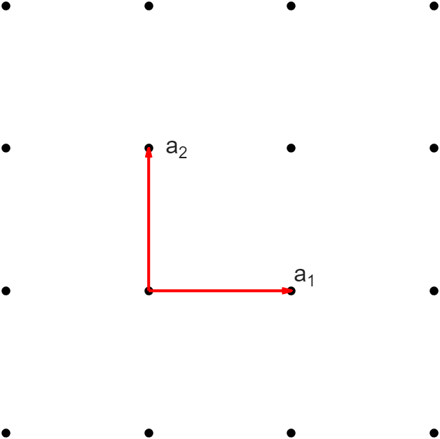
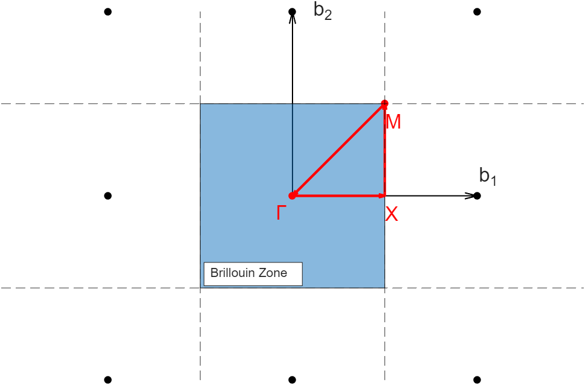
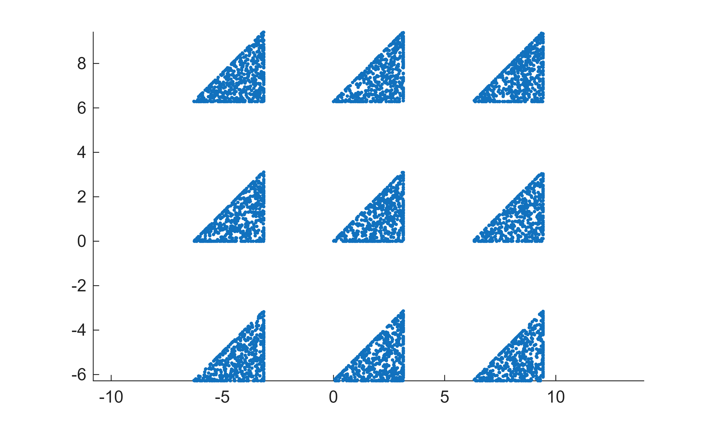
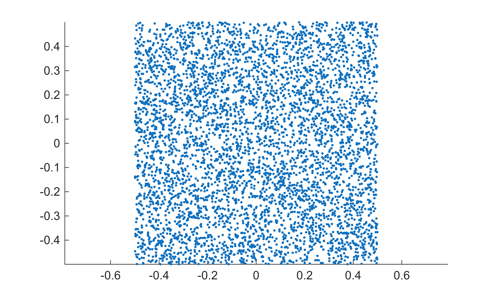
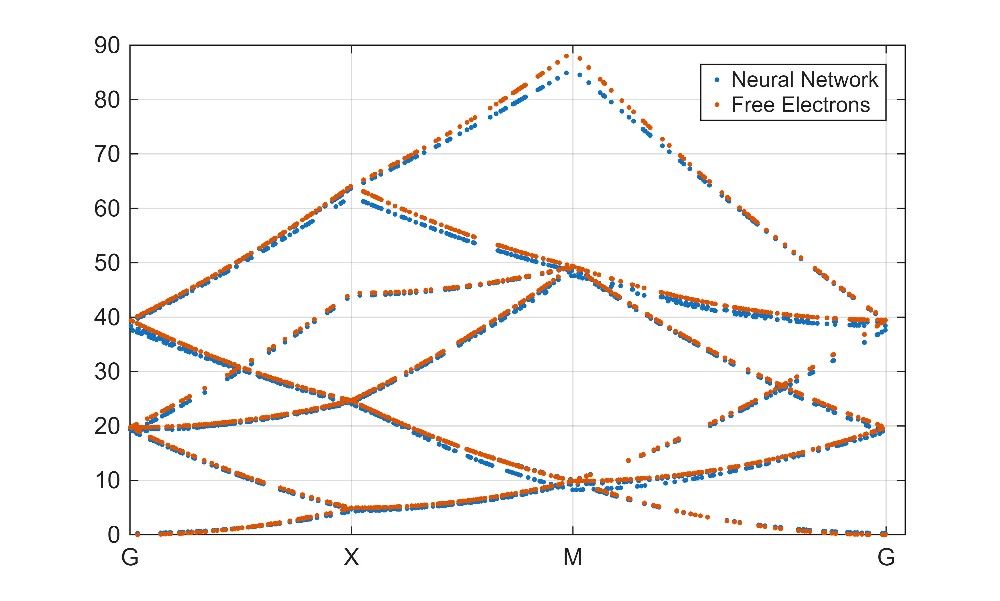
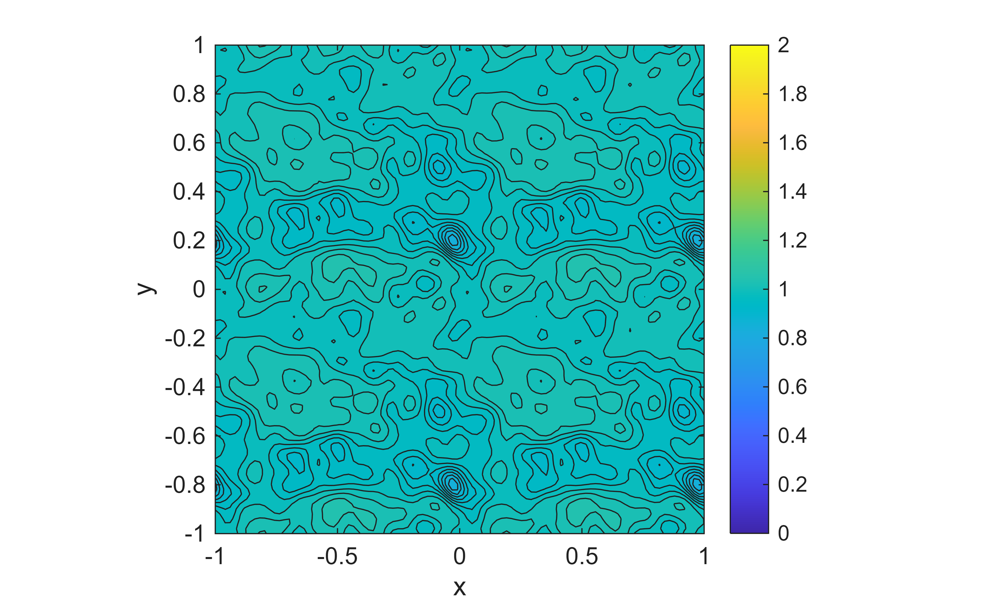

# Simulate Condensed Matter System Using Complex-Valued Physics-Informed Neural Network

This example shows how to train a physics\-informed neural network to simulate the behavior of electrons inside a simplified 2\-D condensed matter system by solving the Schrödinger equation, a complex\-valued partial differential equation.

The code in this example is based on work by Hsu et al \[1,2\]. Periodic boundary conditions are enforced using techniques developed by Shaviner et al \[3\].

Example (live script): 
- [condensedMatterSystemUsingPINNs.m](./condensedMatterSystemUsingPINNs.m)

Supporting files:
- [atomicPseudoPotential.m](./atomicPseudoPotential.m)
- [plotBandStructure.m](./plotBandStructure.m)
- [plotWaveFunction.m](./plotWaveFunction.m)
- [realSpaceSampling.m](./realSpaceSampling.m)
- [reciprocalSpaceSampling.m](./reciprocalSpaceSampling.m)

# MathWorks® Products

Requires MATLAB® release R2025a or newer.

This example uses:

- [Deep Learning Toolbox™](https://mathworks.com/products/deep-learning.html)

# License

The license is available in the [license.txt](../license.txt) file in this GitHub repository.

# Community Support

[MATLAB Central](https://www.mathworks.com/matlabcentral)

# Background

This example shows how to train a physics\-informed neural network to simulate the behavior of electrons inside a simplified 2\-D condensed matter system.

Physical observables, such as temperature, angular momentum, or position, are real numbers. However, in quantum mechanics, the underlying quantity describing the state of a physical system, known as the wave function, is complex\-valued. You can derive the real\-valued physical observables from the complex\-valued wave function. To model the behavior of the wave function, and therefore the behavior of the physical observables, in a quantum mechanical system, solve a complex\-valued partial differential equation known as the Schrödinger equation.

The quantum mechanical state of electrons in crystals can be described in terms of this complex partial differential equation:

 $$ \left\lbrack -\frac{1}{2}\nabla_{\mathbf{r}}^2 +\mathrm{i}\mathbf{k}\cdot \nabla_{\mathbf{r}} -\frac{1}{2}{\mathbf{k}}^2 -V(\mathbf{r})\right\rbrack u_{\mathbf{k}} (\mathbf{r})=E_{\mathbf{k}} u_{\mathbf{k}} (\mathbf{r})\;, $$ 

derived from the Schrödinger equation by using the Bloch theorem. Here, $u_{\mathbf{k}} (\mathbf{r})$ is the periodic part of the electron wave function, $E_{\mathbf{k}}$ is the energy, and $\mathbf{r}$ and $\mathbf{k}$ are the real and reciprocal space coordinates, respectively. For more information, see for example [Bloch's theorem](https://en.wikipedia.org/wiki/Bloch%27s_theorem). 

This example describes how to model a system of free electrons ( $V(\mathbf{r})=0$ ) in a 2\-D square crystal.

Following the work by Hsu et al [\[1\]](#M_9aca), model the system using two simple feedforward networks for the wave functions and energy, respectively. Connect the networks with a loss function that incorporates the Schrödinger equation as well as the periodic boundary conditions. 

# Create Training Data

In this network, the training data is composed of single reciprocal space points for the energy network, and pairs of one real space point and one reciprocal space point for the wave function network.

First, define the crystal structure by defining the lattice constant, as well as the real space and reciprocal lattice vectors. The real space lattice vectors define the periodicity of the crystal:



The lattice constant a is the length of the lattice vectors, and the reciprocal lattice vectors `b1` and `b2`  are related to the real space lattice vectors `a1` and `a2` by the relation:

 $$ {\mathbf{a}}_i \cdot {\mathbf{b}}_j =2\pi \delta_{ij} \;. $$ 

```matlab
crystalStructure.a = 1;
crystalStructure.a1 = crystalStructure.a * [1 0];
crystalStructure.a2 = crystalStructure.a * [0 1];
crystalStructure.b1 = 2*pi/crystalStructure.a * [1 0]; 
crystalStructure.b2 = 2*pi/crystalStructure.a * [0 1];
```

## Create Reciprocal Space Points

Create `nPoints` reciprocal space points using the `reciprocalSpaceSampling` function, attached to this example as a supporting file. 

Take advantage of the crystal symmetry by only sampling from the irreducible Brillouin zone. Then, randomly shift some of the points by reciprocal lattice vectors into the surrounding Brillouin zones. This process is known as the *extended zone scheme*, and it increases the likelihood of the network generating higher\-energy states.

The first 30% of the k\-points vector `kPts` lie along the Brillouin zone path $\Gamma \to X\to M\to \Gamma \;.$ The `reciprocalSpaceSampling` function also returns the position of the path points along the path. Use the Brillouin zone path when plotting the band structure later.



```matlab
crystalStructure.nPoints = 5000;
[kPts,bzBoundaryPosition] = reciprocalSpaceSampling(crystalStructure);
```

Plot the reciprocal space points.

```matlab
figure
scatter(kPts(:,1),kPts(:,2),'.')
axis equal
```



## Create Real Space Points

Next, create `nPoints` real space points randomly sampled from the unit cell using the `realSpaceSampling` function, attached to this example as a supporting file.

```matlab
rPts = realSpaceSampling(crystalStructure);
```

Plot the real space points.

```matlab
figure
scatter(rPts(:,1),rPts(:,2),'.')
axis equal
```



Concatenate the real and reciprocal space points into a single array.

```matlab
XTrain = [rPts kPts];
```

# Create Networks

Start by creating the feedforward networks for the energy and the wave functions. Following Hsu et al [\[1\]](#M_9aca), both networks have four [`fullyConnectedLayer`](https://www.mathworks.com/help/deeplearning/ref/nnet.cnn.layer.fullyconnectedlayer.html) objects separated by [`swishLayer`](https://www.mathworks.com/help/deeplearning/ref/nnet.cnn.layer.swishlayer.html) objects. The fully connected layers in the energy network have output size 384, and the fully connected layers in the wave function network have output size 128.

The energy network takes two inputs $\mathbf{k}=(k_x ,k_y )$ and returns a single output $E_{\mathbf{k}}$.

```matlab
layersE = [
    featureInputLayer(2)        % Input: kx,ky
    fullyConnectedLayer(384)
    swishLayer
    fullyConnectedLayer(384)
    swishLayer
    fullyConnectedLayer(384)
    swishLayer
    fullyConnectedLayer(384)
    swishLayer
    fullyConnectedLayer(1)];    % Output: Ek 
netE = dlnetwork(layersE);
```

The wave function network takes four inputs, $\mathbf{k}=(k_x ,k_y )$ and $\mathbf{r}=(x,y)$ and returns a single complex output $u_{\mathbf{k}} (\mathbf{r})$. In this example, express $u_{\mathbf{k}} (\mathbf{r})$ in terms of two real outputs, the real and imaginary parts of $u_{\mathbf{k}} (\mathbf{r})$, respectively.

**Periodicity.** To ensure that the wave functions satisfy the periodic boundary conditions in both real and reciprocal space, first map the input to a periodic coordinate representation following [\[3\]](#M_54cd). In a square lattice, the real space grid has a lattice constant of $a$, and the reciprocal lattice has a lattice constant of $2\pi /a$.

 $$ \mathbf{\tilde{x} }=\left\lbrack \sin \left(\frac{2\pi }{a}x\right),\cos \left(\frac{2\pi }{a}x\right),\sin \left(\frac{2\pi }{a}y\right),\cos \left(\frac{2\pi }{a}y\right),\sin \left(ak_x \right),\cos \left(ak_x \right),\sin \left(ak_y \right),\cos \left(ak_y \right)\right\rbrack \;. $$ 

Then, to ensure that the network does not have spectral bias, use a *random Fourier feature* to map the coordinates to a higher\-dimensional space[\[3\]](#M_54cd).

 $$ \Phi (\mathbf{\tilde{x} })=\left\lbrack \sin (\mathbf{B\tilde{x} }),\cos (\mathbf{B\tilde{x} })\right\rbrack \;, $$ 

where $\mathbf{B}$ is a random 128\-by\-8 matrix. 128 is the output size of the subsequent fully connected layer, and 8 is the size of $\mathbf{\tilde{x} }$. Multiply the random variable by 2 to sample from a normal distribution with standard deviation 2.

```matlab
B = 2*randn(128,8);
```

To perform this mapping, add two [`functionLayer`](https://www.mathworks.com/help/deeplearning/ref/nnet.cnn.layer.functionlayer.html) objects to the beginning of the network. Specify the functions as [`mapInputsToPeriodicCoordinates`](#M_3e06) and [`randomFourierFeature`](#M_96ae), respectively. These functions are defined at the bottom of this example. Both functions support acceleration, so set the `Acceleratable` name\-value argument to `true`.

```matlab
layersU = [
    featureInputLayer(4)        % Input: x,y,kx,ky
    functionLayer(@(xTrain) mapInputsToPeriodicCoordinates(xTrain,crystalStructure.a),Acceleratable=true)
    functionLayer(@(xTilde) randomFourierFeature(xTilde,B),Acceleratable=true)
    fullyConnectedLayer(128)
    swishLayer
    fullyConnectedLayer(128)
    swishLayer
    fullyConnectedLayer(128)
    swishLayer
    fullyConnectedLayer(128)
    swishLayer
    fullyConnectedLayer(2)];    % Output: Re(uk), Im(uk)
netU = dlnetwork(layersU)
```

```matlabTextOutput
netU = 
  dlnetwork with properties:


         Layers: [12x1 nnet.cnn.layer.Layer]
    Connections: [11x2 table]
     Learnables: [10x3 table]
          State: [0x3 table]
     InputNames: {'input'}
    OutputNames: {'fc_5'}
    Initialized: 1


  View summary with summary.


```

# Create Loss Function

Many physics\-informed neural networks incorporate the equations they are solving into the loss function. For example, to solve a first\-order differential equation of the form $x^{\prime } =f(x,x^{\prime } )$, include the term $|x^{\prime } -f(x,x^{\prime } )|$ in the loss function. This term is minimized by solutions to the differential equation.

In this example, include two loss terms:

- Schrödinger function loss — Ensure the outputs of the two networks combined satisfy the Schrödinger equation, $\left|\left\lbrack -\frac{1}{2}\nabla_{\mathbf{r}}^2 +\mathrm{i}\mathbf{k}\cdot \nabla_{\mathbf{r}} -\frac{1}{2}{\mathbf{k}}^2 -V(\mathbf{r})\right\rbrack u_{\mathbf{k}} (\mathbf{r})-E_{\mathbf{k}} u_{\mathbf{k}} (\mathbf{r})\right|\;.$
- Normalization loss — Ensure that the wave function network generates physically interesting non\-zero wave functions by enforcing the normalization condition: $\int_{\textrm{unit}\;\textrm{cell}} u_{\mathbf{k}}^* (\mathbf{r})u_{\mathbf{k}} (\mathbf{r})\,{\textrm{d}}^2 \mathbf{r}\,{\textrm{d}}^2 \mathbf{k}=1\;.$

The two loss terms are weighted relative to each other.

Specify the atomic pseudo potential, $V(\mathbf{r})$, using the `atomicPseudoPotential` function, attached to this example as a supporting file. This function takes the two real space coordinates `x` and `y` as inputs and returns the potential `V(x,y)`. In this example, the potential is set to zero, $V(\mathbf{r})=0$. To model a different atomic pseudo potential, adapt the `atomicPseudoPotential` function. Using a different potential can require different hyperparameters, such as the relative weights of the loss terms. Choosing hyperparameters requires empirical analysis. To explore different training option configurations by running experiments, you can use the [Experiment Manager](https://www.mathworks.com/help/deeplearning/ref/experimentmanager-app.html) app.

To accelerate the loss function for the custom training loop using the [`dlaccelerate`](https://www.mathworks.com/help/deeplearning/ref/dlaccelerate.html) function, include all loss terms in a single function.

```matlab
function [loss,gradientsE,gradientsU,equationLoss,normalizationLoss] = lossTotal(netE,netU,X,crystalStructure)
x = X(1,:);
y = X(2,:);
kx = X(3,:);
ky = X(4,:);


E = forward(netE,[kx;ky]);
U = forward(netU,[x;y;kx;ky]);


a1 = crystalStructure.a1;
a2 = crystalStructure.a2;


%%% Schrödinger equation loss
V = atomicPseudoPotential(x,y);


U = stripdims(U);
x = stripdims(x);
y = stripdims(y);
UReal = U(1,:);
UImag = U(2,:);


URealSumB = sum(UReal, 2);
UImagSumB = sum(UImag, 2);
dUxReal = dlgradient(URealSumB,x,EnableHigherDerivatives=true);
dUxImag = dlgradient(UImagSumB,x,EnableHigherDerivatives=true);
dUyReal = dlgradient(URealSumB,y,EnableHigherDerivatives=true);
dUyImag = dlgradient(UImagSumB,y,EnableHigherDerivatives=true);


crystalMomentumReal = -(kx.*dUxImag + ky.*dUyImag) - 0.5*(kx.^2 + ky.^2).*UReal;
crystalMomentumImag = kx.*dUxReal + ky.*dUyReal - 0.5*(kx.^2 + ky.^2).*UImag;


atomicPotentialReal = -V.*UReal;
atomicPotentialImag = -V.*UImag;


eigenenergyReal = E.*UReal;
eigenenergyImag = E.*UImag;


kineticEnergyReal = -0.5 * (dllaplacian(URealSumB,x,1) + dllaplacian(URealSumB,y,1));
kineticEnergyImag = -0.5 * (dllaplacian(UImagSumB,x,1) + dllaplacian(UImagSumB,y,1));


lossReal = kineticEnergyReal + crystalMomentumReal + atomicPotentialReal + eigenenergyReal;
lossImag = kineticEnergyImag + crystalMomentumImag + atomicPotentialImag + eigenenergyImag;


equationLoss = lossReal.^2 + lossImag.^2;
equationLoss = sum(equationLoss,2)/numel(x);


%%% Normalization loss
integrationResolution = 100;
integrationPoints = linspace(0,1,integrationResolution)' * a1 + linspace(0,1,integrationResolution)' * a2;
[XIntegration,YIntegration] = meshgrid(integrationPoints(:,1),integrationPoints(:,2));
XIntegration = reshape(XIntegration,1,[]);
YIntegration = reshape(YIntegration,1,[]);


kxForIntegral = kx(1) * ones(size(XIntegration));   % use a different k-point each iteration
kyForIntegral = ky(1) * ones(size(YIntegration));


UToIntegrate = forward(netU,[XIntegration; YIntegration; kxForIntegral; kyForIntegral]');
U2ToIntegrate = UToIntegrate(:,1).^2 + UToIntegrate(:,2).^2;
U2ToIntegrate = reshape(U2ToIntegrate,integrationResolution,[]);


waveFunctionIntegral = trapezoidIntegral(integrationPoints(:,2),trapezoidIntegral(integrationPoints(:,1),U2ToIntegrate));   % custom integral function


normalizationLossWeight = 5e3;  % weigh normalization loss relative to Schrödinger equation loss
normalizationLoss = normalizationLossWeight*abs(1 - waveFunctionIntegral);


%%% Compute total loss
loss = equationLoss + normalizationLoss;
[gradientsE,gradientsU] = dlgradient(loss,netE.Learnables,netU.Learnables);
end
```

# Train Network

To train two networks connected by a single loss function, use a custom training loop. For another example of two networks connected by a shared loss, see [Train Variational Autoencoder (VAE) to Generate Images](https://www.mathworks.com/help/deeplearning/ug/train-a-variational-autoencoder-vae-to-generate-images.html).

Specify the training options. Train for 500 epochs with a mini\-batch size of 5000 and a learning rate of 0.001.

```matlab
numEpochs = 500;
validationFrequency = 20;
miniBatchSize = 5000;
learnRate = 0.001;
```

Create a [`minibatchqueue`](https://uk.mathworks.com/help/deeplearning/ref/minibatchqueue.html) object that processes and manages mini\-batches of data during training. For each mini\-batch:

- Convert the training data to an array datastore
- Format the data with the dimension labels `"BC"` (batch, channel). By default, the `minibatchqueue` object converts the data to `dlarray` objects with underlying type `single`.
- Train on a GPU if one is available. By default, the `minibatchqueue` object converts each output to a `gpuArray` if a GPU is available. Using a GPU requires Parallel Computing Toolbox™ and a supported GPU device. For information on supported devices, see [GPU Computing Requirements](https://uk.mathworks.com/help/parallel-computing/gpu-computing-requirements.html) (Parallel Computing Toolbox).
- To ensure all mini\-batches are the same size, discard any partial mini\-batches.

```matlab
dsTrain = arrayDatastore(XTrain);
mbq = minibatchqueue(dsTrain, ...
    MiniBatchSize = miniBatchSize, ...
    MiniBatchFormat="BC", ...
    PartialMiniBatch="discard");
```

Initialize the parameters for the Adam solver.

```matlab
trailingAvgE = [];
trailingAvgSqE = [];
trailingAvgU = [];
trailingAvgSqU = [];
```

Calculate the total number of iterations for the training progress monitor.

```matlab
numObservationsTrain = size(XTrain,1);
numIterationsPerEpoch = ceil(numObservationsTrain / miniBatchSize);
numIterations = numEpochs * numIterationsPerEpoch;
```

Use the `dlaccelerate` function to speed up the evaluation of the model loss function `lossTotal` in the custom training loop.

```matlab
crystalStructure = structfun(@dlarray,crystalStructure,UniformOutput=false);
lossFcn = dlaccelerate(@lossTotal);
```

Initialize the training progress monitor. Because the timer starts when you create the monitor object, make sure that you create the object close to the training loop.

```matlab
monitor = trainingProgressMonitor( ...
    Metrics=["Loss","EQLoss","NormLoss"], ...
    Info="Epoch", ...
    XLabel="Iteration");
```

Specify a logarithmic scale for the loss.

```matlab
yscale(monitor,"Loss","log")
yscale(monitor,"EQLoss","log")
yscale(monitor,"NormLoss","log")
```

Train the network using a custom training loop. For each epoch, shuffle the data and loop over mini\-batches of data. For each mini\-batch:

- Evaluate the model loss and gradients using the [`dlfeval`](https://www.mathworks.com/help/deeplearning/ref/dlfeval.html) and `modelLoss` functions.
- Update the wave function and energy network parameters using the [`adamupdate`](https://www.mathworks.com/help/deeplearning/ref/adamupdate.html) function.
- Display the training progress.

```matlab
figure
epoch = 0;
iteration = 0;
% Loop over epochs.
while epoch < numEpochs && ~monitor.Stop
    epoch = epoch + 1;


    % Shuffle data.
    shuffle(mbq);


    % Loop over mini-batches.
    while hasdata(mbq) && ~monitor.Stop
        iteration = iteration + 1;


        % Read mini-batch of data.
        X = next(mbq);


        % Evaluate loss and gradients.
        [loss,gradientsE,gradientsU,eqLoss,normLoss] = dlfeval(lossFcn,netE,netU,X,crystalStructure);


        % Update learnable parameters.
        [netE,trailingAvgE,trailingAvgSqE] = adamupdate(netE, ...
            gradientsE,trailingAvgE,trailingAvgSqE,iteration,learnRate);


        [netU, trailingAvgU, trailingAvgSqU] = adamupdate(netU, ...
            gradientsU,trailingAvgU,trailingAvgSqU,iteration,learnRate);


        % Update the training progress monitor. 
        recordMetrics(monitor,iteration,Loss=loss,EQLoss=eqLoss,NormLoss=normLoss);
        updateInfo(monitor,Epoch=epoch + " of " + numEpochs);
        monitor.Progress = 100*iteration/numIterations;
    end
    if mod(epoch, validationFrequency) == 0
        E = forward(netE,kPts);
        plotBandStructure(kPts,E,bzBoundaryPosition)
        drawnow
    end
end
```




# Test Network

Calculate the energies and plot the band structure using the `plotBandStructure` function, attached to this example as a supporting file.

```matlab
E = forward(netE,kPts);
plotBandStructure(kPts,E,bzBoundaryPosition)
```


Plot the lowest energy wave function at the center of the first Brillouin zone in a single unit cell using the `plotWaveFunction` function, attached to this example as a supporting file. For the case of free electrons, the true solution is for the periodic part of the electron wave function, $u_{\mathbf{k}} (\mathbf{r})$, to be constant.

```matlab
k = [0 0];
plotWaveFunction(k,netU,crystalStructure)
```



# Supporting Functions

The `mapInputsToPeriodicCoordinates` function maps the real space and reciprocal space inputs to a periodic coordinate representation following [\[3\]](#M_54cd).

<a id="M_3e06"></a>
```matlab
function xTilde = mapInputsToPeriodicCoordinates(xTrain,a)


x = xTrain(1,:);
y = xTrain(2,:);
kx = xTrain(3,:);
ky = xTrain(4,:);


Lk = 2*pi/a;
xTilde = dlarray(zeros(8,size(x,2)));
xTilde(1,:) = sin(2*pi/a*x);
xTilde(2,:) = cos(2*pi/a*x);
xTilde(3,:) = sin(2*pi/a*y);
xTilde(4,:) = cos(2*pi/a*y);
xTilde(5,:) = sin(2*pi/Lk*kx);
xTilde(6,:) = cos(2*pi/Lk*kx);
xTilde(7,:) = sin(2*pi/Lk*ky);
xTilde(8,:) = cos(2*pi/Lk*ky);
end
```

The `randomFourierFeature` function maps the periodic coordinates to a higher\-dimensional space following [\[3\]](#M_54cd).

<a id="M_96ae"></a>
```matlab
function phi = randomFourierFeature(xTilde,B)
phi = [sin(B*xTilde);cos(B*xTilde)];
end
```

The `trapezoidIntegral` function computes the trapezoidal numerical integration of the `dlarray` `f` with regards to variable `x`. To compute the trapezoidal numerical integration of a numerical array, use the [`trapz`](https://www.mathworks.com/help/matlab/ref/trapz.html) function instead. To calculate a two\-dimensional integral, nest function calls to `trapezoidIntegral`, similar to `trapz`. For more information, see the [Multiple Numerical Integrations](<https://www.mathworks.com/help/matlab/ref/trapz.html#buakefe-1_1>) example.

```matlab
function Q = trapezoidIntegral(x,f)
if isvector(f) % assume dimensions: x n-by-1, f 1-by-n
    Q = (x(2:end) - x(1:end-1)).' * (f(1:end-1) + f(2:end)).'/2;
else % assume dimensions: x n-by-1, f n-by-n
    Q = (x(2:end) - x(1:end-1)).' * (f(1:end-1,:) + f(2:end,:))/2;
end
end
```

[`dlnetwork`](https://www.mathworks.com/help/deeplearning/ref/dlnetwork.html) | [`dlarray`](https://www.mathworks.com/help/deeplearning/ref/dlarray.html) | [`fullyConnectedLayer`](https://www.mathworks.com/help/deeplearning/ref/nnet.cnn.layer.fullyconnectedlayer.html) | [`swishLayer`](https://www.mathworks.com/help/deeplearning/ref/nnet.cnn.layer.swishlayer.html) | [`functionLayer`](https://www.mathworks.com/help/deeplearning/ref/nnet.cnn.layer.functionlayer.html) | [`adamupdate`](https://www.mathworks.com/help/deeplearning/ref/adamupdate.html) | [`trainingProgressMonitor`](https://www.mathworks.com/help/deeplearning/ref/deep.trainingprogressmonitor.html) | [`minibatchqueue`](https://www.mathworks.com/help/deeplearning/ref/minibatchqueue.html) | [`arrayDatastore`](https://www.mathworks.com/help/matlab/ref/matlab.io.datastore.arraydatastore.html)

## Topics
- [Train Variational Autoencoder (VAE) to Generate Images](https://www.mathworks.com/help/deeplearning/ug/train-a-variational-autoencoder-vae-to-generate-images.html)
- [Solve PDE Using Physics\-Informed Neural Network](https://www.mathworks.com/help/deeplearning/ug/solve-partial-differential-equations-with-lbfgs-method-and-deep-learning.html)
- [Solve ODE Using Physics\-Informed Neural Network](https://www.mathworks.com/help/deeplearning/ug/solve-odes-using-a-neural-network.html)
- [Train Network with Complex\-Valued Data](https://www.mathworks.com/help/deeplearning/ug/train-network-with-complex-valued-data.html)

*Copyright 2026 The MathWorks, Inc.*

# References
<a id="M_9aca"></a>
\[1\] Hsu, C., M. Mattheakis, G. R. Schleder, and D. T. Larson. "Equation\-driven Neural Networks for Periodic Quantum Systems". Machine Learning and the Physical Sciences Workshop, NeurOPS 2024. [https://ml4physicalsciences.github.io/2024/files/NeurIPS\_ML4PS\_2024\_165.pdf](https://ml4physicalsciences.github.io/2024/files/NeurIPS_ML4PS_2024_165.pdf)

\[2\] [https://github.com/circee/blochnet](https://github.com/circee/blochnet) 

<a id="M_54cd"></a>
\[3\] Shaviner, G. G., H. Chandravamsi, S. Pisnoy, Z. Chen, and S. H. Frankel. "PINNs for Solving Unsteady Maxwell's Equations: Convergence Issues and Comparative Assessment with Compact Schemes". ArXiv. [https://arxiv.org/pdf/2504.12144](https://arxiv.org/pdf/2504.12144)
