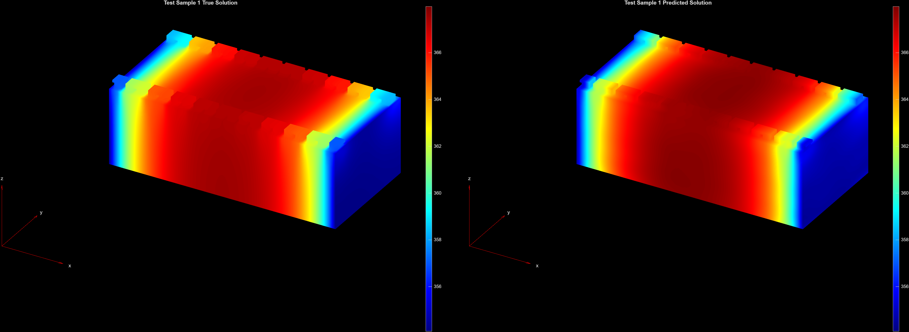
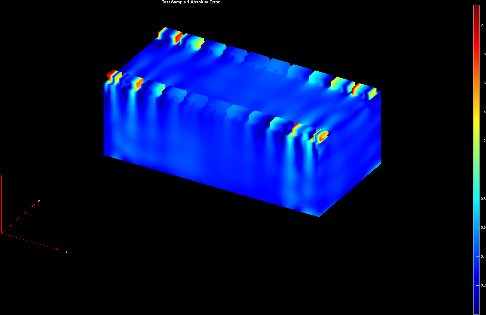

# Tensorized Fourier Neural Operator for 3D Battery Heat Analysis

This example builds off of the [Fourier Neural Operator for 3D Battery Heat Analysis](https://github.com/matlab-deep-learning/SciML-and-Physics-Informed-Machine-Learning-Examples/tree/main/battery-module-cooling-analysis-with-fourier-neural-operator) example to apply a Tensorized Fourier Neural Operator (TFNO) [1, 2] to heat analysis of a 3D battery module. The TFNO compresses the standard Fourier Neural Operator using tensorization, achieving 14.3x parameter reduction while maintaining accuracy.

## Setup

Run the example by running [`tensorizedFourierNeuralOperatorForBatteryCoolingAnalysis.m`](./tensorizedFourierNeuralOperatorForBatteryCoolingAnalysis.m).

## Requirements

Requires:
- [MATLAB](https://www.mathworks.com/products/matlab.html) (R2025a or newer)
- [Deep Learning Toolbox&trade;](https://www.mathworks.com/products/deep-learning.html)
- [Partial Differential Equation Toolbox&trade;](https://mathworks.com/products/pde.html)
- [Parallel Computing Toolbox&trade;](https://mathworks.com/products/parallel-computing.html) (for training on a GPU)

## References
[1] Li, Zongyi, et al. "Fourier Neural Operator for Parametric Partial Differential Equations." 
In International Conference on Learning Representations (2021). https://arxiv.org/pdf/2010.08895

[2] Kossaifi, Jean, et al. Kossaifi, Jean, et al. "Multi-Grid Tensorized Fourier Neural Operator for High-Resolution PDEs." 
Transactions on Machine Learning Research (2024). https://arxiv.org/pdf/2310.00120

## Example Overview

This example applies a 3D Tensorized Fourier Neural Operator (TFNO) to thermal analysis of a battery module composed of 20 cells. Given initial conditions (ambient temperature, convection, heat generation) at T=0, the TFNO predicts temperature distribution at T=10 minutes.

### Architecture Modifications

The TFNO includes two key modifications from the standard FNO:
1. **Transformer-like architecture**: Adds layer normalization, MLPs, and linear skip connections
2. **Tensorized spectral convolution**: Low-rank approximation of weight tensors

### Key Hyperparameters

- **Input channels**: 3 (ambient temperature, convection, heat generation)
- **Output channels**: 1 (temperature)
- **Number of modes**: 4 (retained Fourier modes per dimension)
- **Hidden channels**: 64
- **FNO blocks**: 4
- **Compression rank**: 0.05 (5% of original parameters in spectral layers)
- **Grid resolution**: 32×32×32

### Performance

- **Inference speed**: 88ms per sample (batch size 1) on NVIDIA RTX 2080 Ti GPU and 230ms on Intel Xeon CPU (136x faster than FEM solver, 1.15x faster than the architecture from the prior [FNO example](https://github.com/matlab-deep-learning/SciML-and-Physics-Informed-Machine-Learning-Examples/tree/main/battery-module-cooling-analysis-with-fourier-neural-operator))
    - The speedup may be more pronounced on larger problem domains, higher dimensional problems, and/or when running inference on memory -constrained devices
- **Relative L2 error**: 0.009% error on test set
- **Training time**: 5.75 hours for 1000 epochs
- **Parameter reduction**: From 3,263,809 to 227,521 parameters for a 14.35x reduction
- **Memory savings**: 2.74MB compressed model vs 23.01MB dense model

### Considerations
The example here is one instance of a TFNO applied to battery thermal analysis. It is likely that the TFNO may be further optimized with negligible accuracy loss by:
- Experimenting with higher compression ratios (e.g., 0.01-0.03) to achieve even greater parameter reduction
- Reducing the number of hidden channel dimensions
- Reducing the number of FNO blocks

---
Copyright 2026 The MathWorks, Inc.
