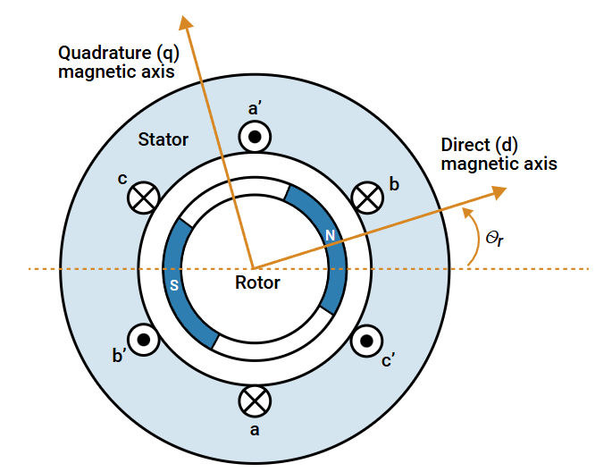
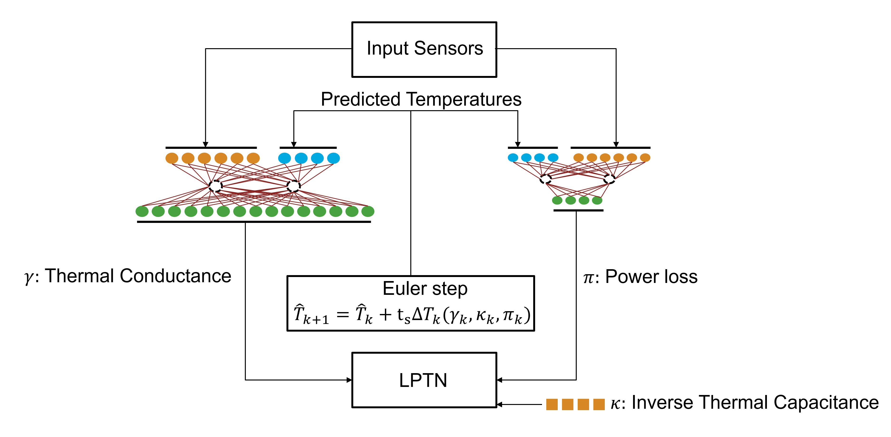
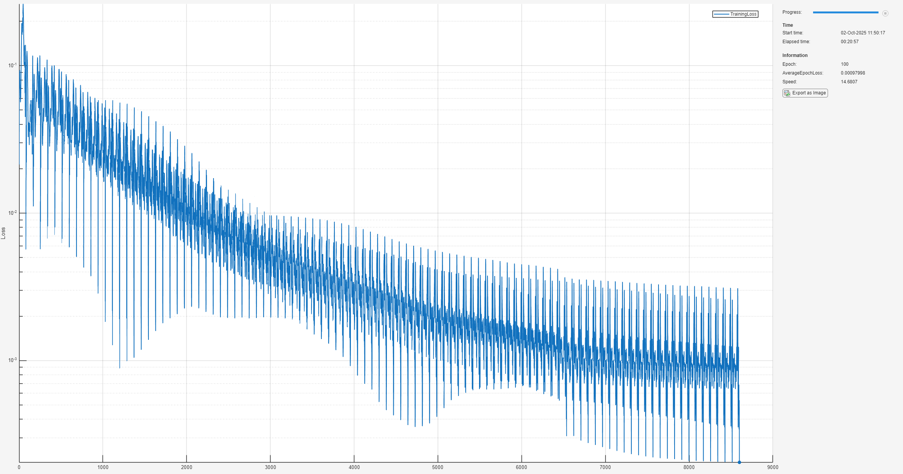
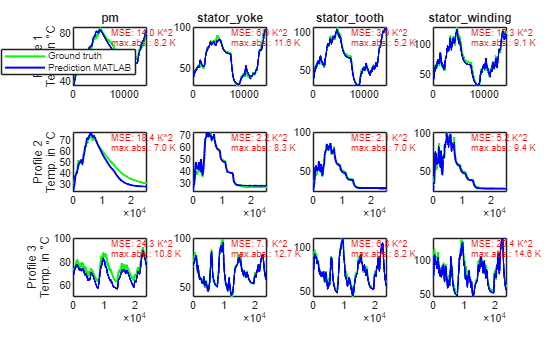

# Thermal Neural Network for Electric Motor Temperature Estimation

This example shows how to create a Thermal Neural Network (TNN) that uses sensor data to estimate temperatures within an electric motor. The implementation follows the approach introduced by Kirchgässner et al. \[[1](#M_560c)\]. 


As electric power systems become more compact with higher power density, thermal stress monitoring becomes increasingly critical. Traditional approaches to thermal modeling face significant limitations:

-  White\-box models (for example, Lumped Parameter Thermal Networks or LPTNs) require detailed geometry, material properties, and expert knowledge. 
-  Black\-box models (for example, deep learning) require large data sets and lack physical interpretability. 

Thermal Neural Networks (TNN) unite both approaches by combining the physical interpretability of LPTNs with the learning capabilities of neural networks. This creates a [physics\-informed machine learning](https://blogs.mathworks.com/deep-learning/2025/06/23/what-is-physics-informed-machine-learning/) model that:

-  Has physically interpretable states through its state\-space representation 
-  Requires no material, geometry, or expert knowledge for its design 

This implementation trains a TNN to estimate temperatures within an electric motor using sensor data. This involves predicting four critical temperature points in a PMSM electric motor: 

-  Permanent magnet  
-  Stator yoke 
-  Stator tooth 
-  Stator winding 




The data set contains various operational measurements from an electric motor, including currents, voltages, torque, speed, and ambient conditions. The TNN model learns to estimate the internal temperatures that would typically require embedded temperature sensors, which are often impractical in production motors.

This example is intended to be an instructional resource demonstrating how to build and train a TNN in MATLAB. For integration and use with Simulink, see the Github repository [here](https://github.com/wkirgsn/thermal-nn/tree/main/matlab). For video content on this topic, check out this recorded MATLAB Expo talk on [Thermal Neural Network for Temperature Modeling in E-Motors](https://www.mathworks.com/videos/thermal-neural-network-for-temperature-modeling-in-e-motors-1762251869161.html) and this [YouTube video](https://youtu.be/ySRjX9GUiCA?si=s7slG-9Ekt6y9wUe). 

# **Setup**
Run the example by running [`ThermalNeuralNetwork.m`](ThermalNeuralNetwork_code.m).

# **Requirements**
MATLAB version R2025a is strongly recommended for full functionality. At a minimum, this example requires MATLAB release R2024a or newer as well as Deep Learning Toolbox. 

# References
<a id="M_560c"></a>
1.  Wilhelm Kirchgässner, Oliver Wallscheid, Joachim Böcker, Thermal neural networks: Lumped\-parameter thermal modeling with state\-space machine learning, Engineering Applications of Artificial Intelligence 117 (2023) 105537. [https://doi.org/10.1016/j.engappai.2022.105537](https://doi.org/10.1016/j.engappai.2022.105537)

# **Prepare Data for Training**

Load the electric motor data set. This data set contains sensor measurements across multiple test profiles.

```matlab
dataFile = "measures_v2.csv";
if ~exist(dataFile,"file")
    location = "https://ssd.mathworks.com/supportfiles/EMTDS/data/raw/ElectricMotorTemperatureDataSet.zip";
    disp("Downloading the Electric Temperature Motor Data Set. This may take a few moments.")
    disp("Acknowledgement: Wilhelm Kirchgässner, Oliver Wallscheid, and Joachim Böcker, Electric Motor Temperature Data Set, Paderborn, 2021. doi:10.34740/KAGGLE/DSV/2161054.")
    unzip(location)
    disp("Download complete.")
end
```

```matlabTextOutput
Downloading the Electric Temperature Motor Data Set. This may take a few moments.
Acknowledgement: Wilhelm Kirchgässner, Oliver Wallscheid, and Joachim Böcker, Electric Motor Temperature Data Set, Paderborn, 2021. doi:10.34740/KAGGLE/DSV/2161054.
Download complete.
```

```matlab
data = readtable("measures_v2.csv")
```


| |u_q|coolant|stator_winding|u_d|stator_tooth|motor_speed|i_d|i_q|pm|stator_yoke|ambient|torque|profile_id|
|:--:|:--:|:--:|:--:|:--:|:--:|:--:|:--:|:--:|:--:|:--:|:--:|:--:|:--:|
|1|-0.4507|18.8052|19.0867|-0.3501|18.2932|0.0029|0.0044|3.2810e-04|24.5542|18.3165|19.8507|0.1871|17|
|2|-0.3257|18.8186|19.0924|-0.3058|18.2948|2.5678e-04|6.0587e-04|-7.8535e-04|24.5381|18.3150|19.8507|0.2454|17|
|3|-0.4409|18.8288|19.0894|-0.3725|18.2941|0.0024|0.0013|3.8647e-04|24.5447|18.3263|19.8507|0.1766|17|
|4|-0.3270|18.8356|19.0830|-0.3162|18.2925|0.0061|2.5584e-05|0.0020|24.5540|18.3308|19.8506|0.2383|17|
|5|-0.4712|18.8570|19.0825|-0.3323|18.2914|0.0031|-0.0643|0.0372|24.5654|18.3267|19.8506|0.2082|17|
|6|-0.5390|18.9015|19.0771|0.0091|18.2906|0.0096|-0.6136|0.3367|24.5736|18.3239|19.8506|0.4762|17|
|7|-0.6531|18.9417|19.0746|0.2389|18.2925|0.0013|-1.0056|0.5542|24.5766|18.3219|19.8506|0.6700|17|
|8|-0.7584|18.9609|19.0825|0.3951|18.2940|0.0014|-1.2884|0.7064|24.5749|18.3147|19.8506|0.7520|17|
|9|-0.7271|18.9735|19.0855|0.5466|18.2920|5.7655e-04|-1.4905|0.8173|24.5671|18.3069|19.8506|0.9105|17|
|10|-0.8743|18.9878|19.0760|0.5789|18.2872|-0.0012|-1.6345|0.8980|24.5532|18.3017|19.8506|0.9240|17|
|11|-0.7670|18.9987|19.0781|0.6893|18.2865|0.0019|-1.7392|0.9520|24.5342|18.3054|19.8506|1.0335|17|
|12|-0.8913|19.0043|19.0832|0.6805|18.2893|-0.0041|-1.8121|0.9955|24.5189|18.3036|19.8770|1.0318|17|
|13|-0.8437|18.9901|19.0896|0.7329|18.2871|0.0034|-1.8670|1.0229|24.5084|18.3122|19.9030|1.0809|17|
|14|-0.8086|18.9654|19.1019|0.8105|18.2845|-0.0036|-1.9037|1.0456|24.5017|18.3138|19.8520|1.1154|17|


The data set contains measurements from various sensors on an electric motor across multiple test profiles. Each row represents a measurement at a specific time point, and each column represents a different sensor or calculated value. In addition to the measured data the `profile_id` column identifies different test profile. You can use the `profile_id` value to separate the training and testing data. 


Define the four target temperatures that you aim to predict:

```matlab
targetTemperatures = ["pm","stator_yoke","stator_tooth","stator_winding"];
```

The remaining columns (except `profile_id`) comprise of electrical and mechanical measurements and are the model inputs.

```matlab
inputParameters = setdiff(data.Properties.VariableNames,["profile_id",targetTemperatures],"stable");
```

To form the LPTN, you need to define a conductance network that connects all temperature nodes. First, identify all temperature\-related columns in the data set. Among the operational parameters, two are temperature measurements (ambient and coolant) that serve as inputs rather than targets. Therefore, you can identify all temperature\-related columns.

```matlab
allTemperatures = [targetTemperatures,["ambient","coolant"]];
```
## Normalize Data

Normalize the temperature values by dividing by 200°C (higher than the maximum observed temperature of 141.36°C) to ensure values remain within \[0, 1\].

```matlab
scale = 200;
for i = 1:length(allTemperatures)
    data.(allTemperatures{i}) = data.(allTemperatures{i})/scale;
end
```

Normalize all non\-temperature input columns by dividing by the maximum values.

```matlab
nonTemperatureColumns = setdiff(inputParameters,["ambient","coolant"]);
for i = 1:length(nonTemperatureColumns)
    columnMax = max(abs(data.(nonTemperatureColumns{i})));
    data.(nonTemperatureColumns{i}) = data.(nonTemperatureColumns{i})/columnMax;
end
```
## Create New Features

Use feature engineering to create additional features that help the model better capture the thermal dynamics, such as calculating the magnitude of current and voltage.

```matlab
if all(ismember(["i_d","i_q","u_d","u_q"],data.Properties.VariableNames))
    data.i_s = sqrt(data.i_d.^2 + data.i_q.^2);
    data.u_s = sqrt(data.u_d.^2 + data.u_q.^2);
    inputParameters = [inputParameters,"i_s","u_s"];
end
```
## Split Data into Training and Test Sets

The dataset contains multiple test profiles with varying operating conditions, allowing the model to learn the thermal behavior across different scenarios. Split the data by profile ID to ensure the model generalizes to unseen operating conditions.

```matlab
allProfiles = unique(data.profile_id,"stable");
testProfiles = [60,62,74]; % Profile ids reserved for the test data.
trainProfiles = setdiff(allProfiles,testProfiles);
```
## Prepare Sequence Data

Use the `prepareSequenceData` function to transform the tabular time series data into a format suitable for training a recurrent neural network. This function:

-  Aligns inputs at time t with targets at t+1 for next\-step forecasting 
-  Creates a 3-D dlarray object (C×B×T format): features × profiles × time steps 
-  Handles variable\-length sequences with zero\-padding and converts to single precision 
-  Generates binary sample weights to mask padded data during training 
```matlab
profileSizes = groupcounts(data,"profile_id");
[trainingData,trainSampleWeights] = prepareSequenceData(data,trainProfiles,profileSizes,inputParameters,targetTemperatures);
[testData,testSampleWeights] = prepareSequenceData(data,testProfiles,profileSizes,inputParameters,targetTemperatures);
```
# Define Network Architecture

The Thermal Neural Network (TNN) is a physics\-informed neural architecture that can model heat transfer dynamics in systems like electric motors. The model learns key thermal parameters (conductance, capacitance, and power loss) directly from the data, eliminating the need for geometry or material specifications.

The core of the TNN is based on a discrete\-time state\-space formulation derived from lumped\-parameter thermal network (LPTN) principles.

-  States: Temperature values of motor components (for example, permanent magnet, stator yoke, stator winding). 
-  Inputs: Operational parameters (for example, motor speed, torque) and ancillary conditions (for example, ambient and coolant temperatures). 

A simplified discrete state equation for each component $i$ of a LPTN model is:

 $$ T_i (k+1)=T_i (k)+t_s \kappa_i (k)\left(\pi_i (k)+\sum_{m\;\in \;components} \gamma_{im} (k)\Delta T_{im} (k)+\sum_{n\;\in \;ancillary} \gamma_{in} (k)\Delta T_{in} (k)\right) $$ 

Where,

-  $\kappa_i$: Inverse thermal capacitance of component $i$ 
-  $\pi_i$: Power loss in component $i$ 
-  $\gamma_{im}$: Thermal conductance between components   
-  $\gamma_{in}$: Thermal conductance between component and ancillary nodes accouting for ambient interactions 
-  $\Delta T_{im}$: Temperature difference between components 
-  $\Delta T_{in}$:  Temperature difference beteeen components and ancillary nodes (for example, ambient, coolant) 
-  $t_s$: Samping time 

This equation is a first\-order Euler discretization of the continuous thermal dynamics of LPTN:


 $\frac{\textrm{d}T}{\textrm{d}t}$  = $\kappa$ \* (components power loss  + heat excange between components + heat exchange with ancillary nodes)




Thermal Neural Networks (TNN) are inspired by general\-purpose Neural Ordinary Differential Equations (NeuralODEs) and Universal Differential Equations (UDEs). A TNN is a hybrid model that embeds neural networks into a discretized ordinary differential equation (ODE) system derived from heat transfer partial differential equations (PDEs) to produce a model with interpretable states.


You can also view TNNs as a physics\-informed special case of a recurrent neural network (RNN), designed specifically for thermal systems. TNNs inherit the recurrent nature of RNNs but add domain\-specific structure and physical interpretability, making them more suitable for engineering applications.


Three subnetworks of a TNN are:

1.  Conductance Network: A neural network that learns thermal conductances between components (how heat flows between different parts)
2. Power Loss Network: A neural network that learns heat generation within components based on operational parameters
3. Thermal Capacitance: Learnable parameters representing the heat capacity of each component.

You can implement the TNN model in two modes:

1.  Optimized mode: Faster implementation with manually defined backward pass
2. Standard mode: Uses automatic differentiation, easier to extend but slower

Define the inputs.

```matlab
numInputs = length(inputParameters);
inputs.targetCols = targetTemperatures;
inputs.inputCols = inputParameters;
inputs.temperatureCols = allTemperatures;
```

To efficiently train on sequential data, use a truncated backpropagation through time (TBPTT) with a window size of 512 time steps. 

```matlab
tbpttSize = 512;
optimizedMode = true;
rng(0) % For reproducibility
modelInputsLayout = networkDataLayout([numel(inputParameters),size(trainingData,2),tbpttSize],"CBT");
targetTemperaturesLayout = networkDataLayout([numel(targetTemperatures),size(trainingData,2)],"CB");

if optimizedMode
    optimizedtnn = optimizedTNNLayer(inputs);
    model = dlnetwork(optimizedtnn,modelInputsLayout,targetTemperaturesLayout);
else
    % Standard mode: The first iteration will take several minutes
    % but subsequent iterations will be faster.
    cellInputLayout = networkDataLayout([numel(inputParameters),size(trainingData,2)],"CB");
    Cell = TNNCell(inputs);
    Cell = generateNetworks(Cell);
    networkCell = dlnetwork(Cell,cellInputLayout,targetTemperaturesLayout);
    DEL = DiffEqLayer(networkCell);
    model = dlnetwork(DEL,modelInputsLayout,targetTemperaturesLayout);
end
```
# Specify Training Options

Use the Adam optimizer with standard hyperparameters for training the network. Initialize parameters for Adam optimizer.

```matlab
learningRate = 1e-3;
beta1 = 0.9;
beta2 = 0.999;
epsilon = 1e-8;
averageGrad = [];
averageSqGrad = [];
iteration = 0;
```
# Train Neural Network

Train the model for 100 epochs with learning rate reduction at epoch 75. Track and report the training progress after each epoch.

```matlab
numEpochs = 100;
numBatchesPerEpoch = ceil(size(trainingData,3)/tbpttSize);

% Improve training performance with dlaccelerate
myModelLoss = dlaccelerate(@lossFun);
maxIterations = numEpochs * numBatchesPerEpoch;

% Set up training monitor
monitor = trainingProgressMonitor(...
    Metrics="TrainingLoss", ...
    Info=["Epoch","AverageEpochLoss","Speed"]);

groupSubPlot(monitor,"Loss","TrainingLoss");
yscale(monitor,"Loss","log")

for epoch = 1:numEpochs
    % Initialize the hidden state with the targets of the first time step
    tic
    hidden = squeeze(trainingData(end-length(targetTemperatures)+1:end,:,1));
    epochLosses = zeros(numBatchesPerEpoch,1); % Array for storing losses per iteration
   
    % Inner loop: iterate over minibatches
    for i = 1:numBatchesPerEpoch
        if monitor.Stop
            break
        end
        iteration = iteration + 1;
        batchInput = trainingData(1:numInputs,:,(i-1)*tbpttSize+1:min(i*tbpttSize,end));
        batchTarget = trainingData(numInputs+1:end,:,(i-1)*tbpttSize+1:min(i*tbpttSize,end));
        sampleWeights = trainSampleWeights(1,:,(i-1)*tbpttSize+1:min(i*tbpttSize,end));

        % Loss and gradient calculation
        [weightedLoss,gradients,hidden] = dlfeval(myModelLoss, ...
            model,batchInput,batchTarget,hidden,sampleWeights);

        % Solver step
        [model,averageGrad,averageSqGrad] = adamupdate(model,gradients,averageGrad,averageSqGrad,iteration, ...
            learningRate,beta1,beta2,epsilon);

        % Extract loss
        epochLosses(i) = extractdata(weightedLoss);
        recordMetrics(monitor,iteration,TrainingLoss=epochLosses(i));
    end

    % Reduce learning rate
    if epoch == 75
        learningRate = learningRate * 0.5;
    end
    meanLoss = mean(epochLosses);
    updateInfo(monitor,Epoch=epoch,AverageEpochLoss=meanLoss,Speed=toc);
    monitor.Progress = 100*epoch/numEpochs;
end
```


# Evaluate Model

Evaluate the trained model on the test data set (profiles 60, 62, 74). Visualize the performance by comparing the predicted and actual temperatures.

```matlab
inferenceFun = dlaccelerate(@(inputs,hiddenState)model.predict(inputs,hiddenState));
[pred,hidden] = inferenceFun(testData(1:numInputs,:,:),squeeze(testData(numInputs+1:end,:,1)));
prediction = extractdata(pred);
```

Generate plots to visualize how well the model predicts the temperature values across different test profiles.

```matlab
profileLengths = profileSizes.GroupCount(ismember(profileSizes.profile_id,testProfiles))-1; % 60,62,74
generatePlots(profileLengths,testData,prediction,scale,targetTemperatures)
```



