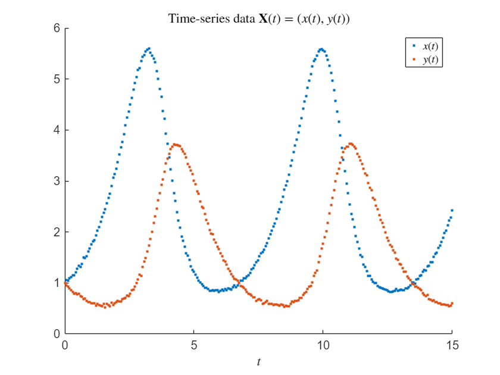
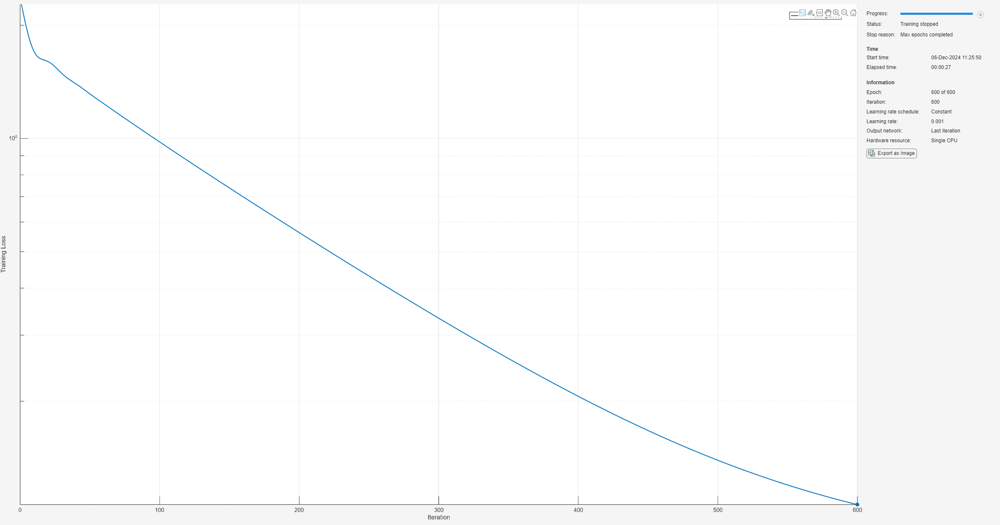
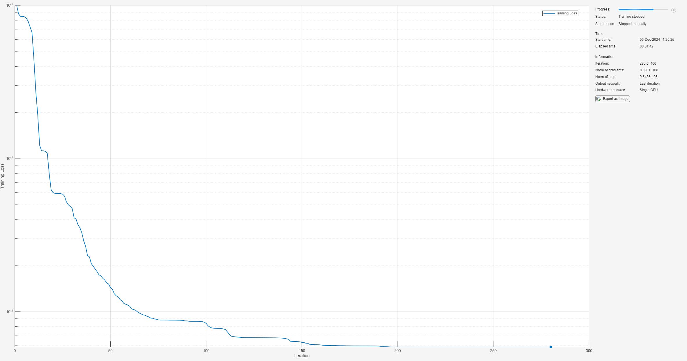
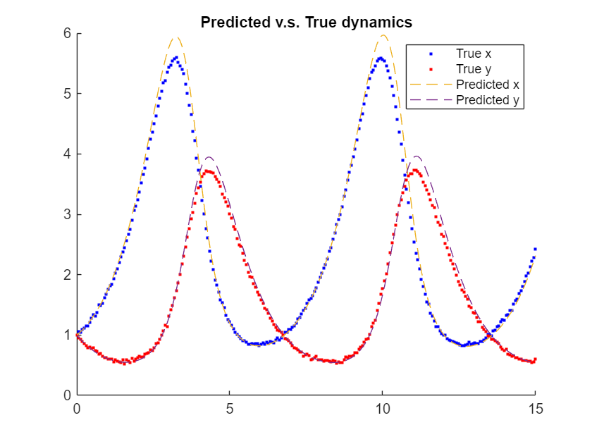

# <span style="color:rgb(213,80,0)">Discovering Differential Equations with Neural ODEs</span>

This example demonstrates how to use neural ODEs to discover underlying differential equations following the Universal Differential Equation \[1\] method.


The method is used for time\-series data originating from ordinary differential equations (ODEs), in particular when not all of the terms of the ODE are known. For example, let $\mathbf{X}(t)\in {\mathbb{R}}^n$ be a time\-series for $t\in [t_0 ,t_1 ]$ and suppose that we know $\mathbf{X}(t)$ satisfies an ODE of the form:

 $$ \frac{\mathrm{d}\mathbf{X}}{\mathrm{d}t}(t)=\mathbf{f}(t,\mathbf{X}(t)),~~t\in [t_0 ,t_1 ],~~\mathbf{f}:[t_0 ,t_1 ]\times {\mathbb{R}}^n \to {\mathbb{R}}^n ,~~(1) $$ 

with initial condition $\mathbf{X}(t_0 )={\mathbf{X}}_0 .$ 


In the case that $\mathbf{f}$ is only partially known, for example $\mathbf{f}(t,\mathbf{X})=\mathbf{g}(t,\mathbf{X})+\mathbf{h}(t,\mathbf{X})$ where $\mathbf{g}:[t_0 ,t_1 ]\times {\mathbb{R}}^n \to {\mathbb{R}}^n$ is a known function, and $\mathbf{h}:[t_0 ,t_1 ]\times {\mathbb{R}}^n \to {\mathbb{R}}^n$ is unknown, the method proposes to model $\mathbf{h}$ by a universal approximator such as a neural network ${\mathbf{h}}_{\theta } :[t_0 ,t_1 ]\times {\mathbb{R}}^n \to {\mathbb{R}}^n$ with learnable parameters $\theta$. 


When $\mathbf{h}$ is replaced by a neural network ${\mathbf{h}}_{\theta }$, equation (1) becomes a neural ODE which can be trained via gradient descent.


Once $\mathbf{h}\_{\theta}$ 
has been trained, symbolic regression methods can be used to find a functional representation of $\mathbf{h}_{\theta}$, such as the SINDy method \[2\].

# Training data

This example uses the Lotka\-Volterra equations for demonstration purposes,

 $$ \mathbf{X}(t)=(x(t),y(t)), $$ 

 $$ \frac{\mathrm{d}x}{\mathrm{d}t}=x-\alpha xy, $$ 

 $$ \frac{\mathrm{d}y}{\mathrm{d}t}=-y+\beta xy, $$ 

where $\alpha ,\beta$ are constants. For the purpose of the example suppose the terms $\alpha xy,\beta xy$ are unknown, and the linear terms are known. In the above notation that is $\mathbf{g}(t,(x,y))=(x,-y)$ are the known terms and $\mathbf{h}(t,(x,y)=(-\alpha xy,\beta xy)$ is unknown.

```matlab
function dXdt = lotkaVolterraODE(X,nvp)
arguments
    X
    nvp.Alpha (1,1) double = 0.6
    nvp.Beta (1,1) double = 0.4
end
x = X(1);
y = X(2);
dxdt = x*(1 - nvp.Alpha*y);
dydt = y*(-1 + nvp.Beta *x);
dXdt = [dxdt; dydt];
end
```

Set $\alpha =0.6$, $\beta =0.4$, $t_0 =0$ and $\mathbf{X}(t_0 )={\mathbf{X}}_0 =(1,1)$.

```matlab
alpha = 0.6;
beta = 0.4;
X0 = [1;1];
```

Solve the ODE using `ode`. For the purpose of the example, add random noise to the solution, as realistic is often noisy.

```matlab
function X = noisySolve(F,ts,nvp)
arguments
    F (1,1) ode
    ts (1,:) double
    nvp.NoiseMagnitude (1,1) double = 2e-2
end
S = solve(F,ts);
X = S.Solution;
% Add noise to the solution, but not the initial condition.
noise = nvp.NoiseMagnitude * randn([size(X,1),size(X,2)-1]);
X(:,2:end) = X(:,2:end) + noise;
end

F = ode(...
    ODEFcn = @(t,X) lotkaVolterraODE(X, Alpha=alpha, Beta=beta),...
    InitialValue = X0);

ts = linspace(0,15,250);
X = noisySolve(F,ts);
scatter(ts,X(1,:),".");
hold on
scatter(ts,X(2,:),".");
title("Time-series data $\mathbf{X}(t) = (x(t),y(t))$", Interpreter="latex")
xlabel("$t$",Interpreter="latex")
legend(["$x(t)$","$y(t)$"], Interpreter="latex")
hold off
```

<center></center>


Take only the data $\mathbf{X}(t),t\in [0,3]$ as training data.

```matlab
tsTrain = ts(ts<=3);
XTrain = X(:,ts<=3);
```
# Design Universal ODE

Recall $\mathbf{f}(t,\mathbf{X})=\mathbf{g}(t,\mathbf{X})+\mathbf{h}(t,\mathbf{X})$ where $\mathbf{g}(t,\mathbf{X})=\mathbf{g}(t,(x,y))=(x,-y)$ is known, and $\mathbf{h}$ is to be approximated by a neural network ${\mathbf{h}}\_{\theta }$. Let ${\mathbf{f}}\_{\theta } (t,\mathbf{X})=\mathbf{g}(t,\mathbf{X})+{\mathbf{h}}\_{\theta } (t,\mathbf{X})$. By representing $\mathbf{g}$ as a neural network layer it is possible to represent ${\mathbf{f}}\_{\theta }$ as a neural network.

```matlab
gFcn = @(X) [X(1,:); -X(2,:)];
gLayer = functionLayer(gFcn, Acceleratable=true, Name="g");
```

Define a neural network for ${\mathbf{h}}_{\theta }$.

```matlab
activationLayer = functionLayer(@softplusActivation,Acceleratable=true);
depth = 3;
hiddenSize = 5;
stateSize = size(X,1);
hLayers = [
    featureInputLayer(stateSize,Name="X")
    repmat([fullyConnectedLayer(hiddenSize); activationLayer],[depth-1,1])
    fullyConnectedLayer(stateSize,Name="h")];
hNet = dlnetwork(hLayers);
```

Add the layer representing $\mathbf{g}$, connect the $\mathbf{X}$ input to $\mathbf{g}(\mathbf{X})$. Also add an `additionLayer` to perform the addition in ${\mathbf{f}}\_{\theta } =\mathbf{g}+{\mathbf{h}}\_{\theta }$ and connect ${\mathbf{h}}\_{\theta }$ to this.

```matlab
fNet = addLayers(hNet, [gLayer; additionLayer(2,Name="add")]);
fNet = connectLayers(fNet,"X","g");
fNet = connectLayers(fNet,"h","add/in2");
```

Analyse the network.

```matlab
analyzeNetwork(fNet)
```

The `dlnetwork` specified by `fNet` represents the function ${\mathbf{f}}_{\theta } (t,\mathbf{X})$ in the neural ODE

 $$ \frac{\mathrm{d}\mathbf{X}}{\mathrm{d}t}(t)={\mathbf{f}}_{\theta } (t,\mathbf{X}(t)). $$ 

To solve the neural ODE, place `fNet` inside a `neuralODELayer`, and solve for the times `tsTrain`.

```matlab
neuralODE = [
    featureInputLayer(stateSize,Name="X0")
    neuralODELayer(fNet, tsTrain, GradientMode="adjoint")];
neuralODE = dlnetwork(neuralODE);
```
# Train the neural ODE

Set the network to `double` precision using `dlupdate`.

```matlab
neuralODE = dlupdate(@double, neuralODE);
```

Specify `trainingOptions` for ADAM and train. For a small neural ODE, often training on the CPU is faster than the GPU, as there is not sufficient parallelism in the neural ODE to make up for the overhead of sending data to the GPU.

```matlab
opts = trainingOptions("adam",...
    Plots="training-progress",...
    MaxEpochs=600,...
    ExecutionEnvironment="cpu",...
    InputDataFormats="CB",...
    TargetDataFormats="CTB");
neuralODE = trainnet(XTrain(:,1),XTrain(:,2:end),neuralODE,"l2loss",opts);
```

```matlabTextOutput
    Iteration    Epoch    TimeElapsed    LearnRate    TrainingLoss
    _________    _____    ___________    _________    ____________
            1        1       00:00:00        0.001          2.2743
           50       50       00:00:03        0.001          1.3138
          100      100       00:00:05        0.001         0.97882
          150      150       00:00:07        0.001         0.73854
          200      200       00:00:09        0.001         0.56192
          250      250       00:00:12        0.001         0.43058
          300      300       00:00:14        0.001         0.33261
          350      350       00:00:16        0.001          0.2598
          400      400       00:00:18        0.001         0.20618
          450      450       00:00:21        0.001         0.16721
          500      500       00:00:23        0.001         0.13936
          550      550       00:00:25        0.001          0.1198
          600      600       00:00:27        0.001         0.10621
Training stopped: Max epochs completed
```

<center></center>


Next train with L\-BFGS to optimize the training loss further.

```matlab
opts = trainingOptions("lbfgs",...
    MaxIterations = 400,...
    Plots="training-progress",...
    ExecutionEnvironment="cpu",...
    GradientTolerance=1e-8,...
    StepTolerance=1e-8,...
    InputDataFormats="CB",...
    TargetDataFormats="CTB");
neuralODE = trainnet(XTrain(:,1),XTrain(:,2:end),neuralODE,"l2loss",opts);
```

```matlabTextOutput
    Iteration    TimeElapsed    TrainingLoss    GradientNorm    StepNorm
    _________    ___________    ____________    ____________    ________
            1       00:00:00         0.10012          1.5837    0.072727
           50       00:00:07        0.001433        0.024051     0.10165
          100       00:00:14      0.00083738        0.015113    0.071645
          150       00:00:23      0.00062907        0.013306    0.037026
          200       00:00:34      0.00058742      0.00016328  0.00036442
          250       00:01:12      0.00058725        0.000197   6.464e-05
Training stopped: Stopped manually
```

<center></center>

# Identify equations for the universal approximator

Extract ${\mathbf{h}}_{\theta }$ from `neuralODE`.

```matlab
fNetTrained = neuralODE.Layers(2).Network;
hNetTrained = removeLayers(fNetTrained,["g","add"]);
lrn = hNetTrained.Learnables;
lrn = dlupdate(@dlarray, lrn);
hNetTrained = initialize(hNetTrained);
hNetTrained.Learnables = lrn;
```

The SINDy method \[2\] takes a library of basis functions ${\mathbf{e}}\_i (t,\mathbf{X}):[t\_0 ,t\_1 ]\times {\mathbb{R}}^n \to {\mathbb{R}}^n$ for $i=1,2,\ldots,N$ and sample points $(\tau\_j ,{\mathbf{X}}\_j )\in [t\_0 ,t\_1 ]\times {\mathbb{R}}^n$. The goal is to identify which terms ${\mathbf{e}}\_i$ represent $h\_{\theta }$. 


Let $\mathbf{E}(t,\mathbf{X})=({\mathbf{e}}\_1 (t,\mathbf{X}),\ldots,{\mathbf{e}}\_N (t,\mathbf{X}))$ denote the matrix formed by concatenating all of the evaluations of the basis functions ${\mathbf{e}}\_i$. Identifying terms ${\mathbf{e}}\_i$ that make up ${\mathbf{h}}\_{\theta }$ can be written as the linear problem ${\mathbf{h}}\_{\theta } (t,\mathbf{X})=\mathbf{W}\mathbf{E}(t,\mathbf{X})$ for a matrix $\mathbf{W}$. 


The SINDy method proposes to use a sparse regression method to solve for $\mathbf{W}$. The sequentially thresholded least squares method \[2\] iteratively solves for $\mathbf{W}$ in the above problem, and zeros out the terms in $\mathbf{W}$ with absolute value below a specified threshold.


Use the training data `XTrain` as the sample points ${\mathbf{X}}\_j$ and evaluate ${\mathbf{h}}\_{\theta } ({\mathbf{X}}\_j )$.

```matlab
Xextra = interp1(tsTrain,XTrain.', linspace(tsTrain(1), tsTrain(2), 100)).';
XSample = [XTrain,Xextra];
hEval = predict(hNetTrained,XSample,InputDataFormats="CB");
```

Denote $\mathbf{X}=(x,y)$ and specify the basis functions ${\mathbf{e}}_1 (x,y)=1,{\mathbf{e}}_2 (x,y)=x^2 ,{\mathbf{e}}_3 (x,y)=xy,{\mathbf{e}}_4 (x,y)=y^2$.  Note that the linear functions $(x,y)\to x$ and $(x,y)\to y$ are not included as the linear terms in $\mathbf{f}$ are already known.

```matlab
e1 = @(X) ones(1,size(X,2));
e2 = @(X) X(1,:).^2;
e3 = @(X) X(1,:).*X(2,:);
e4 = @(X) X(2,:).^2;
E = @(X) [e1(X); e2(X); e3(X); e4(X)];
```

Evaluate the basis functions at the sample points.

```matlab
EEval = E(XSample);
```

Sequentially solve ${\mathbf{h}}_{\theta } =\mathbf{W}\mathbf{E}$ for 10 iterations, and set terms with absolute value less that $0.05$ to $0$.

```matlab
iters = 10;
threshold = 0.1;
Ws = cell(iters,1);
W = hEval/EEval;
Ws{1} = W;
for iter = 2:iters
    belowThreshold = abs(W)<threshold;
    W(belowThreshold) = 0;
    for i = 1:size(W,1)
        aboveThreshold_i = ~belowThreshold(i,:);
        W(i,aboveThreshold_i) = hEval(i,:)/EEval(aboveThreshold_i,:);
    end
    Ws{iter} = W;
end
```

Display the identified equation.

```matlab
Widentified = Ws{end};
fprintf(...
    "Identified dx/dt = %.2f + %.2f x^2 + %.2f xy + %.2f y^2 + %.2f x^3 + %.2f x^2 y + %.2f xy^2 + %.2f y^3 \n", ...
    Widentified(1,1), Widentified(1,2), Widentified(1,3), Widentified(1,4));
```

```matlabTextOutput
Identified dx/dt = 0.00 + 0.00 x^2 + -0.58 xy + 0.00 y^2 + 
```

```matlab
fprintf(...
    "Identified dy/dt = %.2f + %.2f x^2 + %.2f xy + %.2f y^2 + %.2f x^3 + %.2f x^2 y + %.2f xy^2 + %.2f y^3 \n", ...
    Widentified(2,1), Widentified(2,2), Widentified(2,3), Widentified(2,4));
```

```matlabTextOutput
Identified dy/dt = 0.00 + 0.00 x^2 + 0.39 xy + 0.00 y^2 + 
```

# Test the identified model

Now use $\hat{\mathbf{h}} (\mathbf{X})=\mathbf{W}\mathbf{E}(\mathbf{X})$ in place of ${\mathbf{h}}_{\theta }$ and solve the ODE.

```matlab
function dXdt = identifiedModel(X,W,E)
x = X(1);
y = X(2);
% Known terms
dxdt = x;
dydt = -y;
% Identified terms
EEval = E(X);
WE = W*EEval;
dXdt = [dxdt; dydt];
dXdt = dXdt + WE;
end

Fidentified = ode(...
    ODEFcn = @(t,X) identifiedModel(X,W,E),...
    InitialValue = X0);
S = solve(Fidentified,ts);
scatter(ts,X(1,:),'b.');
hold on
scatter(ts,X(2,:),'r.');
plot(S.Time,S.Solution,'--')
title("Predicted v.s. True dynamics");
legend(["True x", "True y","Predicted x", "Predicted y"]);
hold off
```

<center></center>

# Helper Functions
```matlab
function x = softplusActivation(x)
x = max(x,0) + log(1 + exp(-abs(x)));
end
```

References


\[1\] Christopher Rackauckas, Yingbo Ma, Julius Martensen, Collin Warner, Kirill Zubov, Rohit Superkar, Dominic Skinner, Ali Ramadhan, and Alan Edelman. "Universal Differential Equations for Scientific Machine Learning". Preprint, submitted January 13, 2020. [https://arxiv.org/abs/2001.04385](https://arxiv.org/abs/2001.04385)


\[2\] Steven L. Brunton, Joshua L. Proctor, and J. Nathan Kutz. "Discovering governing equations from data by sparse identification of nonlinear dynamical systems". Proceedings of the National Academy of Sciences, 113 (15) 3932\-3937, March 28, 2016.

